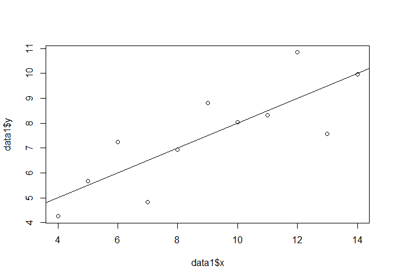
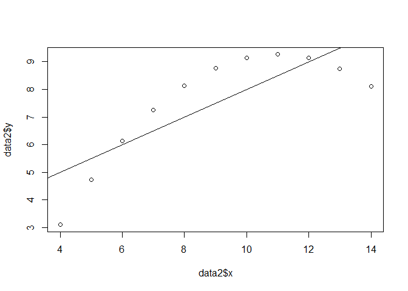
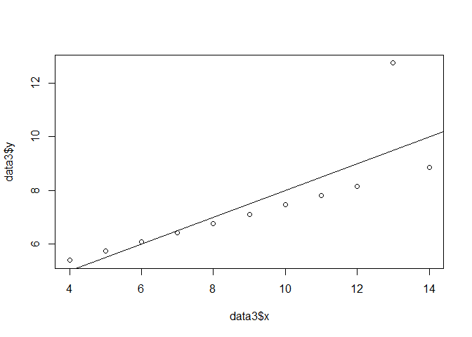
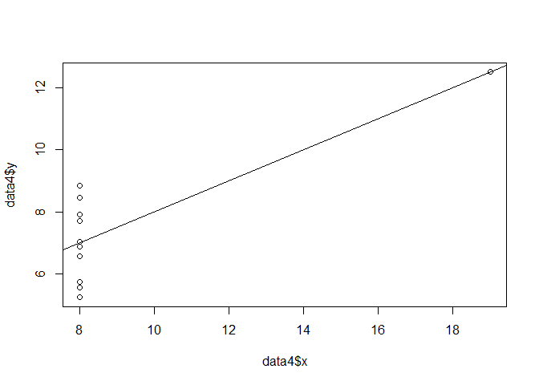
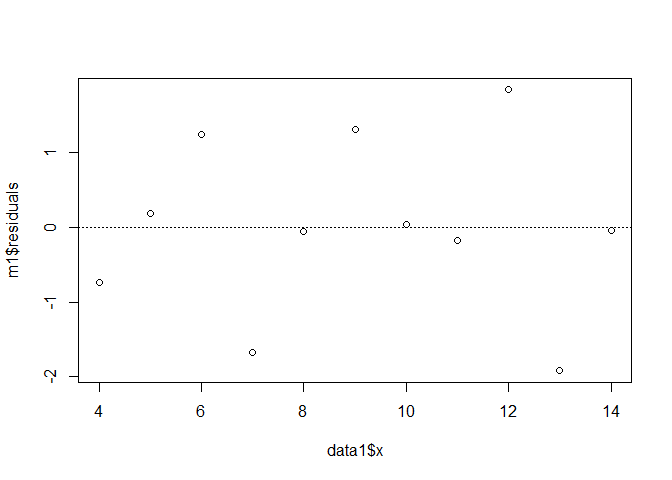
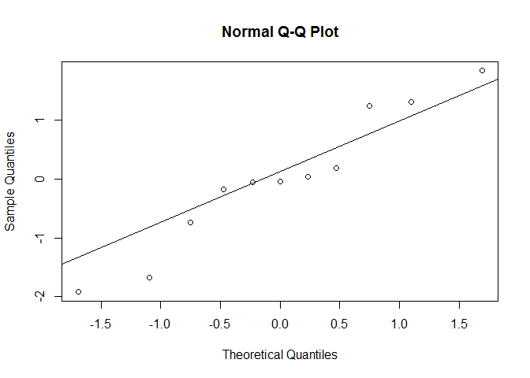
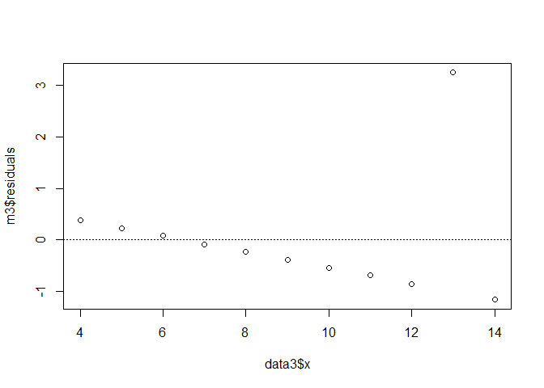
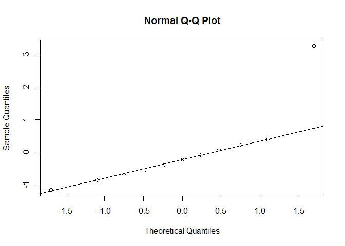

DATA606\_Final\_Exam
================
Yun Mai
May 19, 2017

DATA 606 Spring 2017 - Final Exam
=================================

Part I
------

1.  A student is gathering data on the driving experiences of other college students. A description of the data car color is presented below. Which of the variables are quantitative and discrete?

car. 1 = compact, 2 = standard size, 3 = mini van, 4 = SUV, and 5 = truck

color. red, blue, green, black, white

daysDrive. number of days per week the student drives

gasMonth. the amount of money the student spends on gas per month

1.  car

2.  daysDrive

3.  daysDrive, car

4.  daysDrive, gasMonth

5.  car, daysDrive, gasMonth

Answer: c

1.  A histogram of the GPA of 132 students from this course in Fall 2012 class is presented below. Which estimates of the mean and median are most plausible?

!(<https://raw.githubusercontent.com/YunMai-SPS/DA606/master/DATA606_final%20exam/fe_2.png>)

1.  mean = 3.3, median = 3.5

2.  mean = 3.5, median = 3.3

3.  mean = 2.9, median = 3.8

4.  mean = 3.8, median = 2.9

5.  mean = 2.5, median = 3.8

Answer: c

1.  A researcher wants to determine if a new treatment is effective for reducing Ebola related fever. What type of study should be conducted in order to establish that the treatment does indeed cause improvement in Ebola patients?

<!-- -->

1.  Randomly assign Ebola patients to one of two groups, either the treatment or placebo group, and then compare the fever of the two groups.

2.  Identify Ebola patients who received the new treatment and those who did not, and then compare the fever of those two groups.

3.  Identify clusters of villages and then stratify them by gender and compare the fevers of male and female groups.

4.  Both studies (a) and (b) can be conducted in order to establish that the treatment does indeed cause improvement with regards to fever in Ebola patients.

Answer: a

1.  A study is designed to test whether there is a relationship between natural hair color (brunette, blond, red) and eye color (blue, green, brown). If a large *x*<sup>2</sup> test statistic is obtained, this suggests that:

<!-- -->

1.  there is a difference between average eye color and average hair color.

2.  a person's hair color is determined by his or her eye color.

3.  there is an association between natural hair color and eye color.

4.  eye color and natural hair color are independent

Answer:c

1.  A researcher studying how monkeys remember is interested in examining the distribution of the score on a standard memory task. The researcher wants to produce a boxplot to examine this distribution. Below are summary statistics from the memory task. What values should the researcher use to determine if a particular score is a potential outlier in the boxplot?

``` r
a<-data.frame(min=26, Q1=37, median=45, Q3=49.8, max=65, mean=44.4, sd=8.4, n=50
)
kable(a)
```

|  min|   Q1|  median|    Q3|  max|  mean|   sd|    n|
|----:|----:|-------:|-----:|----:|-----:|----:|----:|
|   26|   37|      45|  49.8|   65|  44.4|  8.4|   50|

1.  37.0 and 49.8

2.  17.8 and 69.0

3.  36.0 and 52.8

4.  26.0 and 50.0

5.  19.2 and 69.9

Answer: b

1.  The\_\_\_\_\_\_are resistant to outliers, whereas the\_\_\_\_\_\_are not.

<!-- -->

1.  mean and median; standard deviation and interquartile range

2.  mean and standard deviation; median and interquartile range

3.  standard deviation and interquartile range; mean and median

4.  median and interquartile range; mean and standard deviation

5.  median and standard deviation; mean and interquartile range

Answer: c

1.  Figure A below represents the distribution of an observed variable. Figure B below represents the distribution of the mean from 500 random samples of size 30 from A. The mean of A is 5.05 and the mean of B is 5.04. The standard deviations of A and B are 3.22 and 0.58, respectively.

!(<https://raw.githubusercontent.com/YunMai-SPS/DA606/master/DATA606_final%20exam/fe_7a.png>) !(<https://raw.githubusercontent.com/YunMai-SPS/DA606/master/DATA606_final%20exam/fe_7b.png>)

1.  Describe the two distributions (2 pts).

Figure A: the distribution is unimodal and right skewed.

Figure B: the distribution is unimodal and nearly normal.

1.  Explain why the means of these two distributions are similar but the standard deviations are not (2 pts).

The means of these two distributions are similar because the sample means should tend to fall around the population mean.

Standard deviations of these two distributions are not similar because the standard deviation of the sample mean tells us how far the typical estimate of population mean is away from the actual population mean while the standard deviation of an observed variable is how far an observation is to the population mean.

1.  What is the statistical principal that describes this phenomenon (2 pts)?

The statistical principal that describes this phenomenon is Central Limit Theorem.If a sample consists of at least 30 independent observations and the data are not strongly skewed, then the distribution of the sample mean is well approximated by a normal model.

Part II
-------

Consider the four datasets, each with two columns (x and y), provided below.

``` r
options(digits=2)
data1 <- data.frame(x=c(10,8,13,9,11,14,6,4,12,7,5),
y=c(8.04,6.95,7.58,8.81,8.33,9.96,7.24,4.26,10.84,4.82,5.68))
data2 <- data.frame(x=c(10,8,13,9,11,14,6,4,12,7,5),
y=c(9.14,8.14,8.74,8.77,9.26,8.1,6.13,3.1,9.13,7.26,4.74))
data3 <- data.frame(x=c(10,8,13,9,11,14,6,4,12,7,5),
y=c(7.46,6.77,12.74,7.11,7.81,8.84,6.08,5.39,8.15,6.42,5.73))
data4 <- data.frame(x=c(8,8,8,8,8,8,8,19,8,8,8),
y=c(6.58,5.76,7.71,8.84,8.47,7.04,5.25,12.5,5.56,7.91,6.89))

data <- as.data.frame(cbind(data1,data2,data3,data4))
colnames(data) <- c("data1.x","data1.y","data2.x","data2.y","data3.x","data3.y","data4.x","data4.y")
kable(data)
```

|  data1.x|  data1.y|  data2.x|  data2.y|  data3.x|  data3.y|  data4.x|  data4.y|
|--------:|--------:|--------:|--------:|--------:|--------:|--------:|--------:|
|       10|      8.0|       10|      9.1|       10|      7.5|        8|      6.6|
|        8|      7.0|        8|      8.1|        8|      6.8|        8|      5.8|
|       13|      7.6|       13|      8.7|       13|     12.7|        8|      7.7|
|        9|      8.8|        9|      8.8|        9|      7.1|        8|      8.8|
|       11|      8.3|       11|      9.3|       11|      7.8|        8|      8.5|
|       14|     10.0|       14|      8.1|       14|      8.8|        8|      7.0|
|        6|      7.2|        6|      6.1|        6|      6.1|        8|      5.2|
|        4|      4.3|        4|      3.1|        4|      5.4|       19|     12.5|
|       12|     10.8|       12|      9.1|       12|      8.2|        8|      5.6|
|        7|      4.8|        7|      7.3|        7|      6.4|        8|      7.9|
|        5|      5.7|        5|      4.7|        5|      5.7|        8|      6.9|

For each column, calculate (to two decimal places):

1.  The mean (for x and y separately; 1 pt).

``` r
mean_data1.x <- format(round(mean(data$data1.x),2),nsmall=2)
paste("mean_data1.x:",mean_data1.x)
```

    ## [1] "mean_data1.x: 9.00"

``` r
mean_data1.y <- format(round(mean(data$data1.y),2),nsmall=2)
paste("mean_data1.y:",mean_data1.y)
```

    ## [1] "mean_data1.y: 7.50"

``` r
mean_data2.x <- format(round(mean(data$data2.x),2),nsmall=2)
paste("mean_data2.x:",mean_data2.x)
```

    ## [1] "mean_data2.x: 9.00"

``` r
mean_data2.y <- format(round(mean(data$data2.y),2),nsmall=2)
paste("mean_data2.y:",mean_data2.y)
```

    ## [1] "mean_data2.y: 7.50"

``` r
mean_data3.x <- format(round(mean(data$data3.x),2),nsmall=2)
paste("mean_data3.x:",mean_data3.x)
```

    ## [1] "mean_data3.x: 9.00"

``` r
mean_data3.y <- format(round(mean(data$data3.y),2),nsmall=2)
paste("mean_data3.y:",mean_data3.y)
```

    ## [1] "mean_data3.y: 7.50"

``` r
mean_data4.x <- format(round(mean(data$data4.x),2),nsmall=2)
paste("mean_data4.x:",mean_data4.x)
```

    ## [1] "mean_data4.x: 9.00"

``` r
mean_data4.y <- format(round(mean(data$data4.y),2),nsmall=2)
paste("mean_data4.y:",mean_data4.y)
```

    ## [1] "mean_data4.y: 7.50"

1.  The median (for x and y separately; 1 pt).

``` r
median_data1.x <- format(round(median(data$data1.x),1),nsmall=1)
paste("median_data1.x:",median_data1.x)
```

    ## [1] "median_data1.x: 9.0"

``` r
median_data1.y <- format(round(median(data$data1.y),1),nsmall=1)
paste("median_data1.y:",median_data1.y)
```

    ## [1] "median_data1.y: 7.6"

``` r
median_data2.x <- format(round(median(data$data2.x),1),nsmall=1)
paste("median_data2.x:",median_data2.x)
```

    ## [1] "median_data2.x: 9.0"

``` r
median_data2.y <- format(round(median(data$data2.y),1),nsmall=1)
paste("median_data2.y:",median_data2.y)
```

    ## [1] "median_data2.y: 8.1"

``` r
median_data3.x <- format(round(median(data$data3.x),1),nsmall=1)
paste("median_data3.x:",median_data3.x)
```

    ## [1] "median_data3.x: 9.0"

``` r
median_data3.y <- format(round(median(data$data3.y),1),nsmall=1)
paste("median_data3.y:",median_data3.y)
```

    ## [1] "median_data3.y: 7.1"

``` r
median_data4.x <- format(round(median(data$data4.x),1),nsmall=1)
paste("median_data4.x:",median_data4.x)
```

    ## [1] "median_data4.x: 8.0"

``` r
median_data4.y <- format(round(median(data$data4.y),3),nsmall=1)
paste("median_data4.y:",median_data4.y)
```

    ## [1] "median_data4.y: 7.0"

1.  The standard deviation (for x and y separately; 1 pt).

``` r
sd_data1.x <- format(round(sd(data$data1.x),2),nsmall=2)
paste("sd_data1.x:",sd_data1.x)
```

    ## [1] "sd_data1.x: 3.32"

``` r
sd_data1.y <- format(round(sd(data$data1.y),2),nsmall=2)
paste("sd_data1.y:",sd_data1.y)
```

    ## [1] "sd_data1.y: 2.03"

``` r
sd_data2.x <- format(round(sd(data$data2.x),2),nsmall=2)
paste("sd_data2.x:",sd_data2.x)
```

    ## [1] "sd_data2.x: 3.32"

``` r
sd_data2.y <- format(round(sd(data$data2.y),2),nsmall=2)
paste("sd_data2.y:",sd_data2.y)
```

    ## [1] "sd_data2.y: 2.03"

``` r
sd_data3.x <- format(round(sd(data$data3.x),2),nsmall=2)
paste("sd_data3.x:",sd_data3.x)
```

    ## [1] "sd_data3.x: 3.32"

``` r
sd_data3.y <- format(round(sd(data$data3.y),2),nsmall=2)
paste("sd_data3.y:",sd_data3.y)
```

    ## [1] "sd_data3.y: 2.03"

``` r
sd_data4.x <- format(round(sd(data$data4.x),2),nsmall=2)
paste("sd_data4.x:",sd_data4.x)
```

    ## [1] "sd_data4.x: 3.32"

``` r
sd_data4.y <- format(round(sd(data$data4.y),2),nsmall=2)
paste("sd_data4.y:",sd_data4.y)
```

    ## [1] "sd_data4.y: 2.03"

For each x and y pair, calculate (also to two decimal places; 1 pt):

1.  The correlation (1 pt).

``` r
cor(data1$x, data1$y)
```

    ## [1] 0.82

``` r
cor(data2$x, data2$y)
```

    ## [1] 0.82

``` r
cor(data3$x, data3$y)
```

    ## [1] 0.82

``` r
cor(data4$x, data4$y)
```

    ## [1] 0.82

1.  Linear regression equation (2 pts).

``` r
m1 <- lm(data1$y ~ data1$x)
summary(m1)
```

    ## 
    ## Call:
    ## lm(formula = data1$y ~ data1$x)
    ## 
    ## Residuals:
    ##     Min      1Q  Median      3Q     Max 
    ## -1.9213 -0.4558 -0.0414  0.7094  1.8388 
    ## 
    ## Coefficients:
    ##             Estimate Std. Error t value Pr(>|t|)   
    ## (Intercept)    3.000      1.125    2.67   0.0257 * 
    ## data1$x        0.500      0.118    4.24   0.0022 **
    ## ---
    ## Signif. codes:  0 '***' 0.001 '**' 0.01 '*' 0.05 '.' 0.1 ' ' 1
    ## 
    ## Residual standard error: 1.2 on 9 degrees of freedom
    ## Multiple R-squared:  0.667,  Adjusted R-squared:  0.629 
    ## F-statistic:   18 on 1 and 9 DF,  p-value: 0.00217

``` r
m2 <- lm(data2$y ~ data2$x)
summary(m2)
```

    ## 
    ## Call:
    ## lm(formula = data2$y ~ data2$x)
    ## 
    ## Residuals:
    ##    Min     1Q Median     3Q    Max 
    ## -1.901 -0.761  0.129  0.949  1.269 
    ## 
    ## Coefficients:
    ##             Estimate Std. Error t value Pr(>|t|)   
    ## (Intercept)    3.001      1.125    2.67   0.0258 * 
    ## data2$x        0.500      0.118    4.24   0.0022 **
    ## ---
    ## Signif. codes:  0 '***' 0.001 '**' 0.01 '*' 0.05 '.' 0.1 ' ' 1
    ## 
    ## Residual standard error: 1.2 on 9 degrees of freedom
    ## Multiple R-squared:  0.666,  Adjusted R-squared:  0.629 
    ## F-statistic:   18 on 1 and 9 DF,  p-value: 0.00218

``` r
m3 <- lm(data3$y ~ data3$x)
summary(m2)
```

    ## 
    ## Call:
    ## lm(formula = data2$y ~ data2$x)
    ## 
    ## Residuals:
    ##    Min     1Q Median     3Q    Max 
    ## -1.901 -0.761  0.129  0.949  1.269 
    ## 
    ## Coefficients:
    ##             Estimate Std. Error t value Pr(>|t|)   
    ## (Intercept)    3.001      1.125    2.67   0.0258 * 
    ## data2$x        0.500      0.118    4.24   0.0022 **
    ## ---
    ## Signif. codes:  0 '***' 0.001 '**' 0.01 '*' 0.05 '.' 0.1 ' ' 1
    ## 
    ## Residual standard error: 1.2 on 9 degrees of freedom
    ## Multiple R-squared:  0.666,  Adjusted R-squared:  0.629 
    ## F-statistic:   18 on 1 and 9 DF,  p-value: 0.00218

``` r
m4 <- lm(data4$y ~ data4$x)
summary(m4)
```

    ## 
    ## Call:
    ## lm(formula = data4$y ~ data4$x)
    ## 
    ## Residuals:
    ##    Min     1Q Median     3Q    Max 
    ## -1.751 -0.831  0.000  0.809  1.839 
    ## 
    ## Coefficients:
    ##             Estimate Std. Error t value Pr(>|t|)   
    ## (Intercept)    3.002      1.124    2.67   0.0256 * 
    ## data4$x        0.500      0.118    4.24   0.0022 **
    ## ---
    ## Signif. codes:  0 '***' 0.001 '**' 0.01 '*' 0.05 '.' 0.1 ' ' 1
    ## 
    ## Residual standard error: 1.2 on 9 degrees of freedom
    ## Multiple R-squared:  0.667,  Adjusted R-squared:  0.63 
    ## F-statistic:   18 on 1 and 9 DF,  p-value: 0.00216

Linear regression equation for data1:
$$\\hat{y}= 3+0.5\\times x$$

Linear regression equation for data1:
$$\\hat{y}= 3+0.5\\times x$$

Linear regression equation for data1:
$$\\hat{y}= 3+0.5\\times x$$

Linear regression equation for data1:
$$\\hat{y}= 3+0.5\\times x$$

1.  R-Squared (2 pts).

For each pair, is it appropriate to estimate a linear regression model? Why or why not? Be specific as to why for each pair and include appropriate plots! (4 pts)

``` r
plot(data1$y ~ data1$x)
abline(m1)
```



    The plot above for data1 shows a upward linear trend. It is appropriate to estimate whether the linear regression model is reliable.

``` r
plot(data2$y ~ data2$x)
abline(m2)
```



    The plot above shows x and y from data2 has a very strong relationship but the trend is not linear. A straight line could not fit the data. Since it is a non-linear relationship, it is not appropriate to estimate the linear regression model.

``` r
plot(data3$y ~ data3$x)
abline(m3)
```



    The plot above shows x and y from data3 has a very strong linear relationship but there are non-normal residuals. There is outliers and the point is very far away from the line. Since it is linear relationship, it is appropriate to estimate the linear model.

``` r
plot(data4$y ~ data4$x)
abline(m4)
```



    The plot above shows that x and y from data4 has no linear relationship. Since there is no linear relationship, it is not appropriate to estimate the linear regression model.

Explain why it is important to include appropriate visualizations when analyzing data. Include any visualization(s) you create. (2 pts)

    From the scatterplot, we can check linearity in the first place to see whether a straight line model is appropriate or not. To acess whether the linear regression modle is reliable, besides linearity, we should also check: nearly normal residuals, constant variability, and independent observations.

As for data1, we can acess whether the linear regression modle is reliable by using visalizations to do model diagnostics.

Linearity: is the relationship between x and y linear?

``` r
plot(m1$residuals ~ data1$x)
abline(h = 0, lty = 3)  
```



Nearly normal residuals:

``` r
qqnorm(m1$residuals)
qqline(m1$residuals)
```



    The normal probability plot of the residuals shows that the residuals is not normal.

Constant variability:

``` r
fitted <- 3+0.5*data1$x
plot(m1$residuals ~ data1$x)
abline(h = 0, lty = 3) 
```


    The above plot shows that the variability is nearly constant.Based on the diagnotic, we conclude linear regression model could not fit data1 as the residuals is not normal.

As for data3, we can acess whether the linear regression modle is reliable by using visalizations to do model diagnostics.

Linearity: is the relationship between x and y linear?

``` r
plot(m3$residuals ~ data3$x)
abline(h = 0, lty = 3)  
```



Nearly normal residuals:

``` r
qqnorm(m3$residuals)
qqline(m3$residuals)
```



    The normal probability plot of the residuals shows that the residuals is normal except one outlier on the higher end deviated far away from the line.

Constant variability:

``` r
fitted <- 3+0.5*data3$x
plot(m3$residuals ~ data3$x)
abline(h = 0, lty = 3) 
```


    The above plot shows that the variability is nearly constant except there one outlier deviated far away from the line. Based on the diagnotic, we conclude linear regression model could not fit data3 since the conditions for linear regression model could not be satisfied.

When we analyze the data, including visualization is very helpful for us to check whether the data satisfy the conditions for fitting linear regression model.
