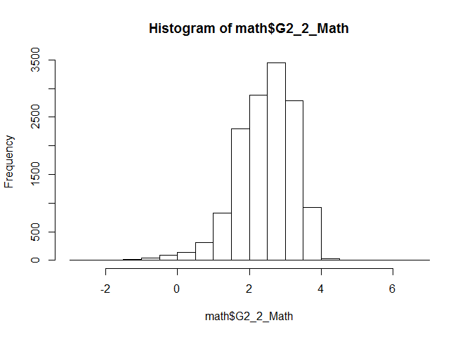
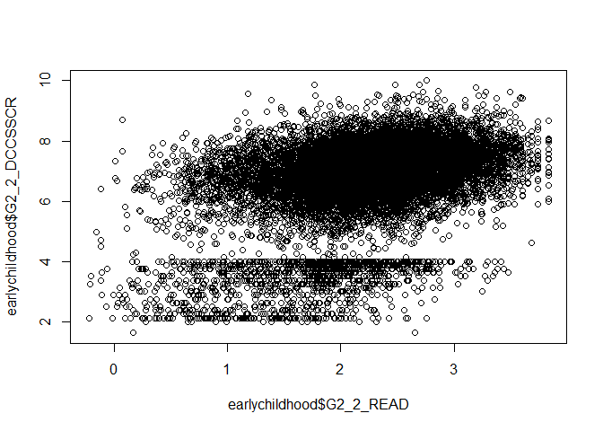
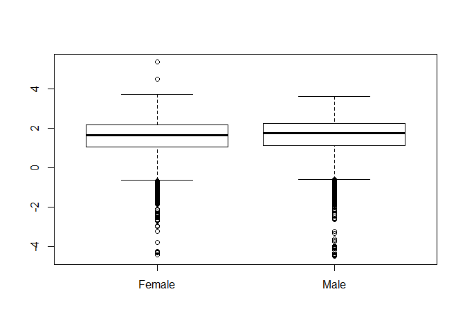
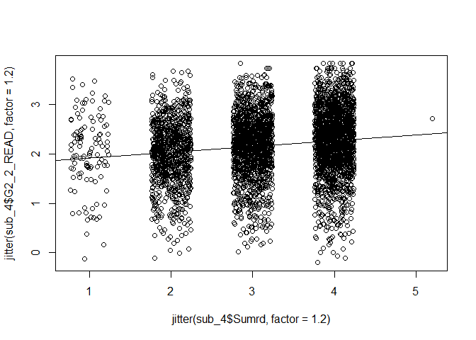

DA606 final project
================
Yun Mai
May 15, 2017

``` r
knitr::opts_chunk$set(echo = TRUE)
```

    install.packages(c('devtools','openintro'))
    devtools::install_github('jbryer/DATA606',force = TRUE)
    install.packages("tibble", repos=c("http://rstudio.org/_packages", "http://cran.rstudio.com"))

Load packages

``` r
library(RCurl)
```

    ## Loading required package: bitops

``` r
library(tibble)
library(dplyr)
```

    ## 
    ## Attaching package: 'dplyr'

    ## The following objects are masked from 'package:stats':
    ## 
    ##     filter, lag

    ## The following objects are masked from 'package:base':
    ## 
    ##     intersect, setdiff, setequal, union

``` r
library(tidyr)
```

    ## 
    ## Attaching package: 'tidyr'

    ## The following object is masked from 'package:RCurl':
    ## 
    ##     complete

``` r
library(stringr)
library(knitr)
library(ggplot2)
library(DATA606)
```

    ## 
    ## Welcome to CUNY DATA606 Statistics and Probability for Data Analytics 
    ## This package is designed to support this course. The text book used 
    ## is OpenIntro Statistics, 3rd Edition. You can read this by typing 
    ## vignette('os3') or visit www.OpenIntro.org. 
    ##  
    ## The getLabs() function will return a list of the labs available. 
    ##  
    ## The demo(package='DATA606') will list the demos that are available.

    ## 
    ## Attaching package: 'DATA606'

    ## The following object is masked from 'package:utils':
    ## 
    ##     demo

### Part 1 - Introduction:

Parent involvement in a child's education is consistently found to be positively associated with a child's academic performance. However, there has been little investigation of the mechanisms that explain this association. The present study examines two potential mechanisms of this association: the child's perception of cognitive competence and the quality of the student-teacher relationship. This study used a sample of 158 seven-year old participants, their mothers, and their teachers. Results indicated a statistically significant association between parent involvement and a child's academic performance, over and above the impact of the child's intelligence. A multiple mediation model indicated that the child's perception of cognitive competence fully mediated the relation between parent involvement and the child's performance on a standardized achievement test. The quality of the student-teacher relationship fully mediated the relation between parent involvement and teacher ratings of the child's classroom academic performance. Limitations, future research directions, and implications for public policy initiatives were discussed.

Research question
-----------------

**You should phrase your research question in a way that matches up with the scope of inference your dataset allows for.**

Q1.1 Are the students from the schools who use the 5-year-old cutoff for Kindergarten entrance have better academic performance? Q1.2 Does parents' education level have effects on children's academic performance in the early childhood?

Q2. Do parent involvement related to early literacy influence child early academy outcomes?

### Part 2 - Data:

Data collection
---------------

The ECLS-K:2011 is the third and latest study in the Early Childhood Longitudinal Study (ECLS) program collected by the [National Center for Educational Statistics](http://nces.ed.gov//) (NCES) from 2010 fall to 2013 spring. Survy were conduct every semester and data from the 2010 fall, 2011 spring, 2012 spring, and 2013 spring are more completed.

Data is collected by NCES and is available online here: <https://nces.ed.gov/ecls/dataproducts.asp>. For this project, data were download and loaded into SPSS as the website suggests, cleaned up (remove most of the repressed variables) and converted to CSV files.

The manual "ECLS-K:2011 Kindergarten User's Manual, Public Version PDF File" and "ECLS-K:2011 Kindergarten-Second Grade User's Manual, Public Version PDF File" is available here: <https://nces.ed.gov/ecls/dataproducts.asp>. The Eclectronic Code Book could be downloaded from the website too.

Cases
-----

The data is from Eearly Childhood Longitutinal Study following a cohort of children from their kindergarten year (the 2010-11 school year, referred to as the base year) through the 2011-12 school year. The sample includes both children who were in kindergarten for the first time and those who were repeating kindergarten during 2010-11. Students from about 1,310 schools and their parents, teachers, school administrators, and before- and after-school care providers participated in the study. Each case represents children who participated, or whose parent participated, in at least one of the two kindergarten data collections (Fall 2010 or Spring 2011).

There are currently 18174 cases in the earlychildhood dataset under consideration. However after data cleaning and considering only complete cases , the number of cases may reduce a bit.

variables
---------

**Response variables**

For both of the questions, the response variables are the scores for four academic assessments: reading, math, science, Dimensional Change Card Sort(DCCS, for kindergarten and first grade), and DCCS computed(adjusted DCCS for second grade). They are numerical variables. This porject will foncus on the second grade results.

**Explanatory variables**

For Q1.1, the explanatory variable is September 1st cutoff. It is categorical variable. For Q1.2, the explanatory variable is parents' highest education level. I would take this variable as numerical variable. American education can be convert as following: a high school level of education is equivalent to 12 years'; an Associate's Degree is equivalent to 14 years', a B.S./B.A. is equivalent to 16 years', etc. a Master's Degree is equivalent to 17-18 years', and Master beyondis equivalent to &gt;= 20 years'.

For Q2, explanatory variables are parent involvment related to early literacy: parent volunteers regularly(Prthlp),(PrtW)

The explanatory variables in the dataset are listed in the table below :

|    X| Name              | Lables                                                                 | Units |  Levels|
|----:|:------------------|:-----------------------------------------------------------------------|:------|-------:|
|    1| CHILDID           | CHILD IDENTIFICATION NUMBER                                            |       |      NA|
|    2| K1\_AGE           | CHILD ASSESSMENT AGE: Kindergarten\_1                                  | years |      NA|
|    3| K2\_AGE           | CHILD ASSESSMENT AGE: Kindergarten\_2                                  | years |      NA|
|    4| G1\_2\_AGE        | CHILD ASSESSMENT AGE: Grade1\_2                                        |       |      NA|
|    5| G2\_2\_AGE        | CHILD ASSESSMENT AGE: Grade2\_2                                        |       |      NA|
|    6| CHSEX             | CHILD COMPOSITE SEX                                                    |       |      NA|
|    7| K1\_READ          | READING: Kindergarten\_1                                               |       |      NA|
|    8| K2\_READ          | READING: Kindergarten\_2                                               |       |      NA|
|    9| G1\_2\_READ       | READING: Grade1\_2                                                     |       |      NA|
|   10| G2\_2\_READ       | READING: Grade2\_2                                                     |       |      NA|
|   11| K1\_Math          | MATH: Kindergarten\_1                                                  |       |      NA|
|   12| K2\_Math          | MATH: Kindergarten\_2                                                  |       |      NA|
|   13| G1\_2\_Math       | MATH: Grade1\_2                                                        |       |      NA|
|   14| G2\_2\_Math       | MATH: Grade2\_2                                                        |       |      NA|
|   15| K2\_SCI           | SCIENCE: Kindergarten\_2                                               |       |      NA|
|   16| G1\_2\_SCI        | SCIENCE: Grade1\_2                                                     |       |      NA|
|   17| G2\_2\_SCI        | SCIENCE: Grade2\_2                                                     |       |      NA|
|   18| K1\_DCCSTOT       | Dimensional Change Card Sort: Kindergarten\_1                          |       |      NA|
|   19| K2\_DCCSTOT       | Dimensional Change Card Sort: Grade1\_2                                |       |      NA|
|   20| G1\_2\_DCCSTOT    | Dimensional Change Card Sort: Grade2\_2                                |       |      NA|
|   21| G2\_2\_DCCSSCR    | Dimensional Change Card Sort computed: Grade2\_2                       |       |      NA|
|   22| K2\_GIFK          | GIFTED-TALENT NOT OFFERED IN K                                         |       |       2|
|   23| G1\_2\_GIFK       | GIFTED-TALENT NOT OFFERED IN G1                                        |       |       2|
|   24| K2\_GIFS          | GIFTED-TALENT NOT OFFERED AT SCHOOL                                    |       |       2|
|   25| G1\_2\_GIFS       | GIFTED-TALENT NOT OFFERED AT SCHOOL                                    |       |       2|
|   26| G2\_2\_Sep1Cut    | A CUTOFF DATE FOR CHILD TO TURN FIVE TO ENTER KINDERGARTEN             |       |       2|
|   27| G2\_2\_Sep1Cut\_t | convert G2\_2\_Sep1Cut value to 1 or 0                                 |       |       2|
|   28| K2\_CLSI          | CLASS SIZES DECREASED: Kindergarten\_2                                 |       |       2|
|   29| G1\_2\_CLSI       | CLASS SIZES DECREASED: Grade1\_2                                       |       |       2|
|   30| G2\_2\_CLSI       | CLASS SIZES DECREASED:Grade2\_2                                        |       |       2|
|   31| PreK              | PRESCHOOL GOOD FOR KINDERGARTEN                                        |       |       5|
|   32| PreKt             | convert PreK value to number                                           |       |       5|
|   33| K1\_LOC           | LOCATION TYPE OF SCHOOL: Kindergarten\_1                               |       |       4|
|   34| K2\_LOC           | LOCATION TYPE OF SCHOOL: Kindergarten\_2                               |       |       4|
|   35| G1\_2\_LOC        | LOCATION TYPE OF SCHOOL: Grade1\_2                                     |       |       4|
|   36| G2\_2\_LOC        | LOCATION TYPE OF SCHOOL: Grade1\_2                                     |       |       4|
|   37| K1\_LOCt          | convert K1\_LOC value to number: 1=CITY, 2=SUBURB, 3=TOWN, 4=RURAL     |       |       4|
|   38| K2\_LOCt          | convert K2\_LOC value to number: 1=CITY, 2=SUBURB, 3=TOWN, 4=RURAL     |       |       4|
|   39| G1\_2\_LOCt       | convert G1\_2\_LOCC value to number: 1=CITY, 2=SUBURB, 3=TOWN, 4=RURAL |       |       4|
|   40| G2\_2\_LOCt       | convert G2\_2\_LOC value to number: 1=CITY, 2=SUBURB, 3=TOWN, 4=RURAL  |       |       4|
|   41| K2\_Prthlp        | PARENT VOLUNTEERS REGULARLY: Kindergarten\_2                           |       |       6|
|   42| G1\_2\_Prthlp     | PARENT VOLUNTEERS REGULARLY: Grade1\_2                                 |       |       6|
|   43| G2\_2\_Prthlp     | PARENT VOLUNTEERS REGULARLY: Grade2\_2                                 |       |       6|
|   44| K1\_PrtW          | PARENTS WORK HOURS PER WEEK: Kindergarten\_1                           |       |       2|
|   45| G1\_2\_PrtW       | PARENTS WORK HOURS PER WEEK: Grade1\_2                                 |       |       2|
|   46| G2\_2\_PrtW       | PARENTS WORK HOURS PER WEEK: Grade2\_2                                 |       |       2|
|   47| PrtEDU            | HIGHEST EDUCATION LEVEL PARENTS ACHIEVED                               |       |       7|
|   48| PrtEDUt           | convert PrtEDU to number: higher number means higher education level   |       |       7|
|   49| K2\_Prtconf       | PARENT ATTEND OPEN HOUSE/PARTY: Kindergarten\_2                        |       |       5|
|   50| G1\_2\_Prtconf    | PARENT ATTEND CONFERENCES: Grade1\_2                                   |       |       5|
|   51| G2\_2\_Prtconf    | PARENT ATTEND OPEN HOUSE/PARTY:Grade2\_2                               |       |       5|
|   52| K2\_Prtoph        | PARENT ATTEND OPEN HOUSE/PARTY: Kindergarten\_2                        |       |       5|
|   53| G1\_2\_Prtoph     | PARENT ATTEND OPEN HOUSE/PARTY: Grade1\_2                              |       |       5|
|   54| G2\_2\_Prtoph     | PARENT ATTEND OPEN HOUSE/PARTY:Grade2\_2                               |       |       5|
|   55| G1\_2\_Prtevt     | PARENT ATTEND ART/MUSIC EVENT: Grade1\_2                               |       |       5|
|   56| G2\_2\_Prtevt     | PARENT ATTEND ART/MUSIC EVENT: Grade2\_2                               |       |       5|
|   57| G1\_2\_Prtpsk     | PARENT OPINOION ON HAVING CHILDREN IN PRESCHOOL                        |       |       2|
|   58| G2\_2\_Prtpsk     | PARENT OPINOION ON HAVING CHILDREN IN PRESCHOOL                        |       |       2|
|   59| Prtpremth         | PARENT OPINOION ON HAVING PRESCH RD/MATH GOOD FOR SCHOOL               |       |       5|
|   60| Prtprelitr        | PARENT OPINOION ON HAVING CHILD KNOW ALPHABET BEFORE K                 |       |       5|
|   61| Prthw             | PARENT PROVIDES HOMEWORK TIME                                          |       |       5|
|   62| Prtrc             | PARENT SHD READ/COUNT WITH CHILD                                       |       |       5|
|   63| Sumsch            | CHILD ATTENDED SUMMER SCHOOL                                           |       |       2|
|   64| Summth            | DO MATH ACTVTY WITH CHILD IN SUMMER                                    |       |       5|
|   65| Sumwrt            | DO WRITING ACTVTY WITH CHILD IN SUMMER                                 |       |       5|

Type of study
-------------

The data used in this project comes from a longitudinal study in which data is gathered for the same subjects repeatedly over a period of time. The subjects were interviewed without any assignment process or experimental design. The data collection process does not interfere with how the data arise, thus it can be classified as an observational study.

Scope of inference
------------------

The population of interest for ECLS pragram consists of all US students from kindergarten through the fifth grade (\*only kindergarten through the second grade data from ECLS pragram were sucessful achieved and used in this project.). Since the respondents where randomly selected then the findings can be generalized.

According to DATA QUALITY AND COMPARABILITY of ECLS pragram on NSES website, the potential errors and bias of the study includ: respondent bias, coverage errors and bias, and nonresponse errors and bias.

One potential source of respondent bias in the ECLS surveys is social desirability bias, when respondents systematically misreport (intentionally or unintentionally) information in a study.

To evaluate and minimize the error and bias, the researchers use the following methods:

1.  "In order to minimize bias, all items were subjected to multiple cognitive interviews and field tests, and actual teachers were involved in the design of the cognitive assessment battery and questionnaires. NCES also followed the criteria recommended in a working paper on the accuracy of teachers' judgments of students' academic performances (see Perry and Meisels 1996)."

2.  By designing the child assessments to be both individually administered and untimed, both coverage error and bias were reduced.

3.  Three methods had been used to to determine if substantial bias was introduced into the data from the kindergarten collections as a result of nonresponse. Findings from these analyses suggest that there is not a substantial bias in the kindergarten year due to nonresponse after adjusting for that nonresponse.

The ECLS program design minimizes potential bias so for the purpose of this project the ECLS results will be considered fully generalizable.

Scope of inference
------------------

Since it is observation data, and not the experiment, there can be no causality, but only correlation.

The data
--------

``` r
# Load data from Github.
url <- getURL("https://raw.githubusercontent.com/YunMai-SPS/DA606/master/final_project/ECLS_2011_K2.csv")
 
library(data.table)
```

    ## -------------------------------------------------------------------------

    ## data.table + dplyr code now lives in dtplyr.
    ## Please library(dtplyr)!

    ## -------------------------------------------------------------------------

    ## 
    ## Attaching package: 'data.table'

    ## The following objects are masked from 'package:dplyr':
    ## 
    ##     between, first, last

``` r
earlyedu <- fread(url, header = T, sep = ',')
kable(head(earlyedu))
```

|   CHILDID|   X6AGE|  X5AGE|  X4AGE|  X3AGE|  X2KAGE\_R|  X1KAGE\_R|  X\_CHSEX\_R|  X1RTHETK2|  X2RTHETK2|  X3RTHETK2|  X4RTHETK2|  X5RTHETK2|  X6RTHETK2|  X1MTHETK2|  X2MTHETK2|  X3MTHETK2|  X4MTHETK2|  X5MTHETK2|  X6MTHETK2|  X2STHETK2|  X3STHETK2|  X4STHETK2|  X5STHETK2|  X6STHETK2|  X1DCCSTOT|  X2DCCSTOT|  X3DCCSTOT|  X4DCCSTOT|  X5DCCSSCR|  X6DCCSSCR|  X6REGION|  X5REGION|  X4REGION|  X3REGION|  X2REGION|  X1REGION|  X6LOCALE|  X5LOCALE|  X4LOCALE|  X3LOCALE|  X2LOCALE|  X1LOCALE|  X6PAR1EMP\_I|  X4PAR1EMP\_I|  X1PAR1EMP|  X4PAR1ED\_I|  X6PAR1OCC\_I|  X4PAR1OCC\_I|  X1PAR1OCC\_I|  X6PAR2OCC\_I|  X4PAR2OCC\_I|  X1PAR2OCC\_I|  X6PAR1SCR\_I|  X4PAR1SCR\_I|  X1PAR1SCR\_I|  X6DISTPOV|  X4DISTPOV|  X\_DISTPOV|  S2GIFNOG|  S2GIFNO|  S4GIFNO|  S4GIFNOG|  S6GIFNOG|  S6GIFNO|  A1ATNDPR|  S6TTLPRE|  S4TTLPRE|  A1INKNDR|  A1VSTK|  A1SHRTN|  A1STAGGR|  A1PRNTOR|  A1HMEVST|  A1COMM|  A1IDCOLO|  A1FOLWDR|  A1ALPHBT|  A1SITSTI|  A1SENSTI|  A1ENGLAN|  A1NOTDSR|  A1PENCIL|  A1PRBLMS|  A1SHARE|  A1CNT20|  A1FNSHT|  S6CCLSDE|  S6TT1CLA|  S4TT1CLA|  S2TT1CLA|  A1FRMLIN|  A1ALPHBF|  A1LRNREA|  A1TCHPRN|  A1PRCTWR|  A1HMWRK|  A1READAT|  A1CNTRLC|  A1ENJOY|  A1MKDIFF|  A1TEACH|  A1CLSSIZ|  A1NATEXM|  A1EARLY|  A1ELEM|  A1DEVLP|  A1MTHDRD|  A1MTHDMA|  A1MTHDSC|  A1RSPINT|  A1INTSRV|  A1STATCT|  A1HIGHQL|  A1YRBORN|  A1HGHSTD|  A1HGHPAR|  A1YRSCH|  P3DOMATH|  P3DOWRIT|  P3RDBKTC|  P3HWLGRD|  P3RDALON|  P3COMEDU|  P3OUTACT|  P3TVHR|  P3TVMIN|  P3VIDHR|  P3VIDMIN|  P3VISLIB|  P3STHLIB|  P3SUMBK|  P3SUMRD|  P3ARTMUS|  P3ZOOS|  P3AMUSPK|  P3BEACHS|  P3PLYCRT|  P3LRGCTY|  P3SUMSCH|  P3NDYPRM|  P3NHRPRM|  P3SMREAD|  P3SMMATH|  P3SMSCI|  P3SMART|  P3SMMUSI|  P3SMCMPT|  P3SMREQ|  P3DONCMP|  P3NUMCMP|  P3NMDCMP|  P3NMHCMP|  P3NMWCMP|  P3CMPSPT|  P3CMPART|  P3CMPCPT|  P3CMPACA|  P3CMPMPA|  P3CMPSUP|  P3TUTOR|  A2REGHLP|  A4REGHLP|  A6REGHLP|  A2TPCONF|  A4TPCONF|  A6TPCONF|  A2ATTOPN|  A4ATTOPN|  A6ATTOPN|  VAR00001|  A4ATTART|  A6ATTART|
|---------:|-------:|------:|------:|------:|----------:|----------:|------------:|----------:|----------:|----------:|----------:|----------:|----------:|----------:|----------:|----------:|----------:|----------:|----------:|----------:|----------:|----------:|----------:|----------:|----------:|----------:|----------:|----------:|----------:|----------:|---------:|---------:|---------:|---------:|---------:|---------:|---------:|---------:|---------:|---------:|---------:|---------:|-------------:|-------------:|----------:|------------:|-------------:|-------------:|-------------:|-------------:|-------------:|-------------:|-------------:|-------------:|-------------:|----------:|----------:|-----------:|---------:|--------:|--------:|---------:|---------:|--------:|---------:|---------:|---------:|---------:|-------:|--------:|---------:|---------:|---------:|-------:|---------:|---------:|---------:|---------:|---------:|---------:|---------:|---------:|---------:|--------:|--------:|--------:|---------:|---------:|---------:|---------:|---------:|---------:|---------:|---------:|---------:|--------:|---------:|---------:|--------:|---------:|--------:|---------:|---------:|--------:|-------:|--------:|---------:|---------:|---------:|---------:|---------:|---------:|---------:|---------:|---------:|---------:|--------:|---------:|---------:|---------:|---------:|---------:|---------:|---------:|-------:|--------:|--------:|---------:|---------:|---------:|--------:|--------:|---------:|-------:|---------:|---------:|---------:|---------:|---------:|---------:|---------:|---------:|---------:|--------:|--------:|---------:|---------:|--------:|---------:|---------:|---------:|---------:|---------:|---------:|---------:|---------:|---------:|---------:|---------:|--------:|---------:|---------:|---------:|---------:|---------:|---------:|---------:|---------:|---------:|---------:|---------:|---------:|
|  10000001|  103.66|     NA|  91.66|     NA|      79.76|      72.39|            1|     0.1930|     1.7614|         NA|     3.1523|         NA|     3.3637|     0.5827|     1.5384|         NA|     2.7286|         NA|     3.2950|     1.3738|         NA|     3.3354|         NA|     2.5071|         16|         17|         NA|         16|         NA|     7.3280|        -2|        -2|        -2|        -2|        -2|        -2|         4|        NA|         4|        NA|         4|         4|             4|             4|          4|            5|            -1|            -1|            -1|            19|            19|            19|         -1.00|         -1.00|         -1.00|         38|         39|          45|        -9|       -9|        1|         0|         0|        0|         3|         1|         2|         1|       1|        1|         2|         1|         2|       3|         2|         3|         2|         3|         3|         2|         3|         3|         2|        3|        2|        3|         2|         1|         1|         2|         3|         2|         4|         4|         3|        2|         4|         4|        5|         5|        4|         5|         1|        1|       1|        1|         1|         1|         1|         1|         2|         1|         3|         7|         5|         6|        5|        NA|        NA|        NA|        NA|        NA|        NA|        NA|      NA|       NA|       NA|        NA|        NA|        NA|       NA|       NA|        NA|      NA|        NA|        NA|        NA|        NA|        NA|        NA|        NA|        NA|        NA|       NA|       NA|        NA|        NA|       NA|        NA|        NA|        NA|        NA|        NA|        NA|        NA|        NA|        NA|        NA|        NA|       NA|         3|         2|         2|         5|         5|         5|         3|         5|         3|         3|         5|         5|
|  10000002|      NA|     NA|  89.56|     NA|      77.52|      71.41|            2|    -0.7870|     0.7452|         NA|     2.2023|         NA|         NA|    -0.3473|     0.8800|         NA|     2.0825|         NA|         NA|     0.8811|         NA|     1.3122|         NA|         NA|         17|         16|         NA|         16|         NA|         NA|        -2|        -2|        -2|        -2|        -2|        -2|        NA|        NA|         2|        NA|         2|         2|            NA|             4|          4|            5|            NA|            -1|            -1|            NA|             1|             1|            NA|         -1.00|         -1.00|         NA|          7|           7|         1|        1|        1|         0|        NA|       NA|         3|        NA|        -1|         1|       1|        2|         2|         1|         2|       4|         3|         4|         3|         3|         3|         4|         4|         2|         4|        5|        3|        3|        NA|        NA|        -1|         2|         2|         3|         4|         2|         2|        1|         5|         5|        5|         5|        5|         2|         1|        1|       1|        1|         1|         1|         1|         2|         2|         1|         1|         2|         5|         5|       27|        NA|        NA|        NA|        NA|        NA|        NA|        NA|      NA|       NA|       NA|        NA|        NA|        NA|       NA|       NA|        NA|      NA|        NA|        NA|        NA|        NA|        NA|        NA|        NA|        NA|        NA|       NA|       NA|        NA|        NA|       NA|        NA|        NA|        NA|        NA|        NA|        NA|        NA|        NA|        NA|        NA|        NA|       NA|         2|         4|        NA|         5|         5|        NA|         5|         4|        NA|        NA|         4|        NA|
|  10000003|   96.26|     NA|  84.33|     NA|      73.51|         NA|            1|         NA|     0.3323|         NA|     1.1861|         NA|     2.0689|         NA|     1.0112|         NA|     2.2080|         NA|     2.8384|     0.4244|         NA|     2.2479|         NA|     2.3529|         NA|         14|         NA|         16|         NA|     8.2395|        -2|        -2|        -2|        -2|        -2|        -2|         2|        NA|         2|        NA|         2|        NA|             1|             1|         NA|            9|             7|             7|            NA|            -1|            -1|            NA|         77.50|         77.50|            NA|         12|         11|           9|         2|        1|        1|         0|         0|        1|        NA|        -1|        -1|        NA|      NA|       NA|        NA|        NA|        NA|      NA|        NA|        NA|        NA|        NA|        NA|        NA|        NA|        NA|        NA|       NA|       NA|       NA|         1|        -1|        -1|        -1|        NA|        NA|        NA|        NA|        NA|       NA|        NA|        NA|       NA|        NA|       NA|        NA|        NA|       NA|      NA|       NA|        NA|        NA|        NA|        NA|        NA|        NA|        NA|        NA|        NA|        NA|       NA|        NA|        NA|        NA|        NA|        NA|        NA|        NA|      NA|       NA|       NA|        NA|        NA|        NA|       NA|       NA|        NA|      NA|        NA|        NA|        NA|        NA|        NA|        NA|        NA|        NA|        NA|       NA|       NA|        NA|        NA|       NA|        NA|        NA|        NA|        NA|        NA|        NA|        NA|        NA|        NA|        NA|        NA|       NA|         2|         2|         4|         5|         5|         5|         5|         5|         5|         5|         5|         4|
|  10000004|  101.19|     NA|  89.23|     NA|      78.84|      72.39|            1|    -1.7087|    -0.2922|         NA|     0.8632|         NA|     1.5117|    -2.1245|    -0.2834|         NA|     1.1082|         NA|     2.8392|     0.6509|         NA|     0.2933|         NA|     1.7845|         15|         14|         NA|         17|         NA|     7.2868|        -2|        -2|        -2|        -2|        -2|        -2|         4|        NA|         4|        NA|         4|         4|            NA|             1|          1|            5|            NA|            13|            13|            NA|            16|            16|            NA|         38.18|         38.18|         20|         20|          17|        -9|       -9|        0|         0|         0|        0|         5|         1|         1|         2|       1|        2|         2|         1|         2|       5|         4|         4|         5|         5|         3|        -9|         5|         5|         3|        4|        4|        4|         1|         1|         2|         2|         5|         5|         5|         4|         4|        2|         5|         5|        5|         5|        5|         5|         2|        2|       2|        1|         2|         2|         2|         2|         2|         1|         1|         5|         5|         5|        6|        NA|        NA|        NA|        NA|        NA|        NA|        NA|      NA|       NA|       NA|        NA|        NA|        NA|       NA|       NA|        NA|      NA|        NA|        NA|        NA|        NA|        NA|        NA|        NA|        NA|        NA|       NA|       NA|        NA|        NA|       NA|        NA|        NA|        NA|        NA|        NA|        NA|        NA|        NA|        NA|        NA|        NA|       NA|         2|         2|         3|         3|         3|         3|         3|         4|         3|         3|         5|         3|
|  10000005|      NA|     NA|     NA|     NA|      65.06|      59.51|            2|    -0.0734|     0.8013|         NA|         NA|         NA|         NA|    -0.5545|     0.6163|         NA|         NA|         NA|         NA|     0.3996|         NA|         NA|         NA|         NA|         14|         17|         NA|         NA|         NA|         NA|        -2|        -2|        -2|        -2|        -2|        -2|        NA|        NA|        NA|        NA|         2|         2|            NA|            NA|          1|           NA|            NA|            NA|             4|            NA|            NA|             1|            NA|            NA|         59.00|         NA|         NA|          -1|        NA|       NA|       NA|        NA|        NA|       NA|         5|        NA|        NA|         1|       1|        2|         2|         1|         2|       5|         4|         5|         5|         5|         4|         4|         5|         4|         3|        5|        4|        4|        NA|        NA|        NA|        NA|         5|         5|         5|         5|         5|        5|         5|         4|        5|         5|        5|         5|         1|        1|       2|        1|         1|         1|         1|         2|         2|         1|         2|         5|         4|         3|        7|        NA|        NA|        NA|        NA|        NA|        NA|        NA|      NA|       NA|       NA|        NA|        NA|        NA|       NA|       NA|        NA|      NA|        NA|        NA|        NA|        NA|        NA|        NA|        NA|        NA|        NA|       NA|       NA|        NA|        NA|       NA|        NA|        NA|        NA|        NA|        NA|        NA|        NA|        NA|        NA|        NA|        NA|       NA|         2|        NA|        NA|         5|        NA|        NA|         5|        NA|        NA|        NA|        NA|        NA|
|  10000006|  107.51|     NA|  94.82|     NA|      82.62|      75.78|            2|    -1.4601|    -0.6792|         NA|     1.0132|         NA|     1.9750|    -1.0616|    -0.5379|         NA|     0.4484|         NA|     1.0869|    -0.6320|         NA|    -0.7748|         NA|    -0.2110|         16|         14|         NA|         18|         NA|     5.3872|        -2|        -2|        -2|        -2|        -2|        -2|         4|        NA|         4|        NA|         4|         4|             3|             1|          1|            3|            20|            19|            19|            -1|            -1|            -1|         35.92|         33.42|         33.42|         10|         12|          11|        -9|       -9|        0|         0|         0|        0|         4|         2|         1|         2|       1|        1|         1|         1|         2|       4|         4|         4|         3|         4|         4|         3|         3|         4|         3|        4|        3|        4|         1|         1|         1|         2|         3|         3|         4|         4|         3|        2|         4|         4|        5|         4|        4|         5|         2|        2|       1|        1|         1|         1|         1|         2|         2|         1|         1|         8|         5|         2|        8|        NA|        NA|        NA|        NA|        NA|        NA|        NA|      NA|       NA|       NA|        NA|        NA|        NA|       NA|       NA|        NA|      NA|        NA|        NA|        NA|        NA|        NA|        NA|        NA|        NA|        NA|       NA|       NA|        NA|        NA|       NA|        NA|        NA|        NA|        NA|        NA|        NA|        NA|        NA|        NA|        NA|        NA|       NA|         2|         2|         2|         5|         5|         5|         2|         5|         2|         2|         5|         5|

``` r
# Load value lables from Github.
lable <- read.csv("https://raw.githubusercontent.com/YunMai-SPS/DA606/master/final_project/variablelable.csv")
kable(head(lable,n=10))
```

| Variable    |  Position| Label                              | Measurement.Level | Role  |  Column.Width| Alignment | Print.Format | Write.Format |
|:------------|---------:|:-----------------------------------|:------------------|:------|-------------:|:----------|:-------------|:-------------|
| CHILDID     |         1| CHILD IDENTIFICATION NUMBER        | Nominal           | Input |            10| Left      | A8           | A8           |
| X6AGE       |         2| X6 CHILD ASSESSMENT AGE(MNTHS)     | Scale             | Input |             9| Right     | F7.2         | F7.2         |
| X5AGE       |         3| X5 CHILD ASSESSMENT AGE(MNTHS)     | Scale             | Input |             9| Right     | F7.2         | F7.2         |
| X4AGE       |         4| X4 CHILD ASSESSMENT AGE(MNTHS)     | Scale             | Input |             8| Right     | F6.2         | F6.2         |
| X3AGE       |         5| X3 CHILD ASSESSMENT AGE(MNTHS)     | Scale             | Input |             8| Right     | F6.2         | F6.2         |
| X2KAGE\_R   |         6| X2 CHILD ASSESSMENT AGE(MNTHS)-REV | Scale             | Input |            10| Right     | F6.2         | F6.2         |
| X1KAGE\_R   |         7| X1 CHILD ASSESSMENT AGE(MNTHS)-REV | Scale             | Input |            10| Right     | F6.2         | F6.2         |
| X\_CHSEX\_R |         8| CHILD COMPOSITE SEX - REVISED      | Scale             | Input |            11| Right     | F2           | F2           |
| X1RTHETK2   |         9| X1 READING THETA-K2 DATA FILE      | Scale             | Input |            11| Right     | F8.4         | F8.4         |
| X2RTHETK2   |        10| X2 READING THETA-K2 DATA FILE      | Scale             | Input |            11| Right     | F8.4         | F8.4         |

``` r
value <- read.csv("https://raw.githubusercontent.com/YunMai-SPS/DA606/master/final_project/variablevalue.csv")
kable(head(value, n=10))
```

| Value       | Label               |
|:------------|:--------------------|
| X6AGE       | -9: NOT ASCERTAINED |
| X5AGE       | -9: NOT ASCERTAINED |
| X4AGE       | -9: NOT ASCERTAINED |
| X3AGE       | -9: NOT ASCERTAINED |
| X2KAGE\_R   | -9: NOT ASCERTAINED |
| X1KAGE\_R   | -9: NOT ASCERTAINED |
| X\_CHSEX\_R | -9: NOT ASCERTAINED |
| X\_CHSEX\_R | 1: MALE             |
| X\_CHSEX\_R | 2: FEMALE           |
| X1RTHETK2   | -9: NOT ASCERTAINED |

Select the semester for anlysis.The prefix of the variables name could be infered from the table below. The prefix are 1:2010 fall(K1): 2011 spring(K2); 3, 2011 fall(11f); 4: 2012 sprinsg(G1\_2); 5: 2012 fall(12f): 6: 2013 spring(G2\_2).


``` r
# There are a lot of columns in these data frames. I will subset the dataframes to get the variables relevant to the analysis and also rename the columns for reading convenience.

# The data were collected through 6 consecutive semesters. In some semesters the survay were only done in one thirds of students. 

# The data from the survay with same sample size will be selected for this project. I will subset the data to get the survey results from 4 semesters: Kindergarten 1st semester(1), Kindergarten 2nd semester(2), first grade 2nd semester(4), second grade 2nd semester(6). 

# reading scores
myreading <- c("CHILDID","X1RTHETK2",   "X2RTHETK2",    "X4RTHETK2",    "X6RTHETK2") 
reading <- subset(earlyedu,,myreading)
reading$X1RTHETK2 <- as.character(reading$X1RTHETK2)
reading$X2RTHETK2 <- as.character(reading$X2RTHETK2)
reading$X4RTHETK2 <- as.character(reading$X4RTHETK2)
reading$X6RTHETK2 <- as.character(reading$X6RTHETK2)
reading$X1RTHETK2 <- str_replace_all(reading$X1RTHETK2,"(^\\-9)","")
reading$X2RTHETK2 <- str_replace_all(reading$X2RTHETK2,"(^\\-9)","")
reading$X4RTHETK2 <- str_replace_all(reading$X4RTHETK2,"(^\\-9)","")
reading$X6RTHETK2 <- str_replace_all(reading$X6RTHETK2,"(^\\-9)","")
reading$X1RTHETK2 <- as.numeric(reading$X1RTHETK2)
reading$X2RTHETK2 <- as.numeric(reading$X2RTHETK2)
reading$X4RTHETK2 <- as.numeric(reading$X4RTHETK2)
reading$X6RTHETK2 <- as.numeric(reading$X6RTHETK2)
colnames(reading) <- c("CHILDID", "K1_READ", "K2_READ", "G1_2_READ", "G2_2_READ")

# math scores
mymath <- c("CHILDID","X1MTHETK2",  "X2MTHETK2",    "X4MTHETK2",    "X6MTHETK2") 
math <- subset(earlyedu,,mymath)
math$X1MTHETK2 <- as.character(math$X1MTHETK2)
math$X2MTHETK2 <- as.character(math$X2MTHETK2)
math$X4MTHETK2 <- as.character(math$X4MTHETK2)
math$X6MTHETK2 <- as.character(math$X6MTHETK2)
math$X1MTHETK2 <- str_replace_all(math$X1MTHETK2,"(^\\-9)","")
math$X2MTHETK2 <- str_replace_all(math$X2MTHETK2,"(^\\-9)","")
math$X4MTHETK2 <- str_replace_all(math$X4MTHETK2,"(^\\-9)","")
math$X6MTHETK2 <- str_replace_all(math$X6MTHETK2,"(^\\-9)","")
math$X1MTHETK2 <- as.numeric(math$X1MTHETK2)
math$X2MTHETK2 <- as.numeric(math$X2MTHETK2)
```

    ## Warning: NAs introduced by coercion

``` r
math$X4MTHETK2 <- as.numeric(math$X4MTHETK2)
math$X6MTHETK2 <- as.numeric(math$X6MTHETK2)
colnames(math) <- c("CHILDID", "K1_Math", "K2_Math", "G1_2_Math", "G2_2_Math")

# science scores
myscience <- c("CHILDID", "X2STHETK2",  "X4STHETK2",    "X6STHETK2") 
science <- subset(earlyedu,,myscience)
science$X2STHETK2 <- as.character(science$X2STHETK2)
science$X4STHETK2 <- as.character(science$X4STHETK2)
science$X6STHETK2 <- as.character(science$X6STHETK2)
science$X2STHETK2 <- str_replace_all(science$X2STHETK2,"(^\\-9)","")
science$X4STHETK2 <- str_replace_all(science$X4STHETK2,"(^\\-9)","")
science$X6STHETK2 <- str_replace_all(science$X6STHETK2,"(^\\-9)","")
science$X2STHETK2 <- as.numeric(science$X2STHETK2)
science$X4STHETK2 <- as.numeric(science$X4STHETK2)
```

    ## Warning: NAs introduced by coercion

``` r
science$X6STHETK2 <- as.numeric(science$X6STHETK2)
colnames(science) <- c("CHILDID", "K2_SCI", "G1_2_SCI", "G2_2_SCI")

# The Dimensional Change Card Sort (DCCS): A Method of Assessing Executive Function in Children
myDCCSTOT <- c("CHILDID", "X1DCCSTOT",  "X2DCCSTOT",    "X4DCCSTOT") 
DCCSTOT <- subset(earlyedu,,myDCCSTOT)
DCCSTOT$X1DCCSTOT <- as.character(DCCSTOT$X1DCCSTOT)
DCCSTOT$X2DCCSTOT <- as.character(DCCSTOT$X2DCCSTOT)
DCCSTOT$X4DCCSTOT <- as.character(DCCSTOT$X4DCCSTOT)
DCCSTOT$X1DCCSTOT <- str_replace_all(DCCSTOT$X1DCCSTOT,"(^\\-9)","")
DCCSTOT$X2DCCSTOT <- str_replace_all(DCCSTOT$X2DCCSTOT,"(^\\-9)","")
DCCSTOT$X4DCCSTOT <- str_replace_all(DCCSTOT$X4DCCSTOT,"(^\\-9)","")
DCCSTOT$X1DCCSTOT <- as.numeric(DCCSTOT$X1DCCSTOT)
DCCSTOT$X2DCCSTOT <- as.numeric(DCCSTOT$X2DCCSTOT)
DCCSTOT$X4DCCSTOT <- as.numeric(DCCSTOT$X4DCCSTOT)
colnames(DCCSTOT) <- c("CHILDID", "K1_DCCSTOT", "K2_DCCSTOT", "G1_2_DCCSTOT")

# DCCS composite score by summing the post-switch score and the Border Game score. Relative completed survay results are only available at 6th semester.
myDCCSSCR <- c("CHILDID", "X6DCCSSCR") 
DCCSSCR <- subset(earlyedu,,myDCCSSCR)
DCCSSCR$X6DCCSSCR <- as.character(DCCSSCR$X6DCCSSCR)
DCCSSCR$X6DCCSSCR <- str_replace_all(DCCSSCR$X6DCCSSCR,"(^\\-9)","")
DCCSSCR$X6DCCSSCR <- as.numeric(DCCSSCR$X6DCCSSCR)
colnames(DCCSSCR) <- c("CHILDID", "G2_2_DCCSSCR")

# GIFTED-TALENT not offered in K. Survay results are only available at 2nd and 4th semester.
GTKlevels <- c("yes", "no", "NA")
myGTK <- c("CHILDID", "S2GIFNO","S4GIFNO") 
GTK <- subset(earlyedu,,myGTK)
GTK$S2GIFNO <- str_replace_all(GTK$S2GIFNO,"(^\\-9)|(^\\-1)","NA") %>% 
  str_replace_all("1","yes") %>% 
  str_replace_all("2","no")
GTK$S4GIFNO <- str_replace_all(GTK$S4GIFNO,"(^\\-9)|(^\\-1)","NA") %>% 
  str_replace_all("0","yes") %>%
  str_replace_all("1","no")
colnames(GTK) <- c("CHILDID", "K2_GIFK", "G1_2_GIFK")

# GIFTED-TALENT offered at some grades or not offered at the school.Survay results are only available at 2nd and 4th semester.
GTSlevels <- c("yes", "no", "NA")
myGTS <- c("CHILDID", "S2GIFNOG","S4GIFNOG") 
GTS <- subset(earlyedu,,myGTS)
GTS$S2GIFNOG <- str_replace_all(GTS$S2GIFNOG,"(^\\-9)|(^\\-1)","NA") %>% 
   str_replace_all("1","yes") %>% 
  str_replace_all("2","no")
GTS$S4GIFNOG <- str_replace_all(GTS$S4GIFNOG,"(^\\-9)|(^\\-1)","NA") %>%
  str_replace_all("0","yes") %>% 
  str_replace_all("1","no")
colnames(GTS) <- c("CHILDID", "K2_GIFS", "G1_2_GIFS")

# A CUTOFF DATE FOR CHILD TO TURN FIVE TO ENTER KINDERGARTEN
Sep1cutofflevels <- c(1,2,NA)
mycutoff <- c("CHILDID", "S6GIFNO") 
Sep1cutoff <- subset(earlyedu,,mycutoff)
Sep1cutoff$S6GIFNOt <- str_replace_all(Sep1cutoff$S6GIFNO,"0","yes") %>% 
  str_replace_all("1","no")
colnames(Sep1cutoff) <- c("CHILDID", "G2_2_Sep1Cut", "G2_2_Sep1Cut_t")

# Whether PreK is helpful for prepare children for Kindergarten.
PreKlevles <- c(1, 2, 3, 4, 5)
myprek <- c("CHILDID", "A1ATNDPR") 
PreK <- subset(earlyedu,,myprek)
PreK$A1ATNDPR  <- str_replace_all(PreK$A1ATNDPR,"^\\-9","NA") 
PreK$A1ATNDPRt  <- str_replace_all(PreK$A1ATNDPR, "1","STRONGLY DISAGREE") %>% 
  str_replace_all("2","DISAGREE") %>% 
  str_replace_all("3","NEITHER AGREE NOR DISAGREE") %>% 
  str_replace_all("4","AGREE") %>% 
  str_replace_all("5","STRONGLY AGREE") 
colnames(PreK) <- c("CHILDID", "PreK", "PreKt")

agelevels <- c(4, 5, 6, 7, 8)
myage <- c("CHILDID", "X1KAGE_R", "X2KAGE_R", "X4AGE", "X6AGE") 
Age <- subset(earlyedu,,myage)
Age[,2]<- Age[,2]/12
Age[,3]<- Age[,3]/12
Age[,4]<- Age[,4]/12
Age[,5]<- Age[,5]/12
Age$X1KAGE_R <-as.character(Age$X1KAGE_R)
Age$X2KAGE_R <-as.character(Age$X2KAGE_R)
Age$X4AGE <-as.character(Age$X4AGE)
Age$X6AGE <-as.character(Age$X6AGE)
Age$X1KAGE_R <-str_replace_all(Age$X1KAGE_R,"^\\-9","NA")
Age$X2KAGE_R <-str_replace_all(Age$X2KAGE_R,"^\\-9","NA")
Age$X4AGE <-str_replace_all(Age$X4AGE,"^\\-9","NA")
Age$X6AGE <-str_replace_all(Age$X6AGE,"^\\-9","NA")
Age$X1KAGE_R <-as.numeric(Age$X1KAGE_R)
Age$X2KAGE_R <-as.numeric(Age$X2KAGE_R)
Age$X4AGE <-as.numeric(Age$X4AGE)
Age$X6AGE <-as.numeric(Age$X6AGE)
colnames(Age) <- c("CHILDID", "K1_AGE", "K2_AGE", "G1_2_AGE", "G2_2_AGE")

genderLevels <- c('Male', 'Female')
mygender <- c("CHILDID", "X_CHSEX_R") 
Gender <- subset(earlyedu,,mygender)
Gender$X_CHSEX_R <- str_replace_all(Gender$X_CHSEX_R,"1","Male") %>% 
  str_replace_all("2","Female")
Gender$X_CHSEX_R <- str_replace_all(Gender$X_CHSEX_R,"^\\-9","NA")
colnames(Gender) <- c("CHILDID", "CHSEX")

#class size decrease?
decreasesizelevel <- c("yes", "no", "NA")
mydecreasesize <- c("CHILDID", "S2TT1CLA", "S4TT1CLA", "S6TT1CLA") 
Classsize <- subset(earlyedu,,mydecreasesize)
Classsize$S2TT1CLA <- str_replace_all(Classsize$S2TT1CLA,"(^\\-9)|(^\\-1)","NA") %>% 
  str_replace_all("1","yes") %>% 
  str_replace_all("2","no")
Classsize$S4TT1CLA <- str_replace_all(Classsize$S4TT1CLA,"(^\\-9)|(^\\-1)","NA") %>% 
  str_replace_all("1","yes") %>%
  str_replace_all("2","no")
Classsize$S6TT1CLA <- str_replace_all(Classsize$S6TT1CLA,"(^\\-9)|(^\\-1)","NA") %>% 
  str_replace_all("1","yes") %>% 
  str_replace_all("2","no")
colnames(Classsize) <- c("CHILDID", "K2_CLSI", "G1_2_CLSI", "G2_2_CLSI")
Classsize$K2_CLSIt <- str_replace_all(Classsize$K2_CLSI, "yes", "1") %>%
  str_replace_all("no", "2")
Classsize$G1_2_CLSIt <- str_replace_all(Classsize$G1_2_CLSI, "yes", "1") %>%
  str_replace_all("no", "2") 
Classsize$G2_2_CLSIt <- str_replace_all(Classsize$G2_2_CLSI, "yes", "1") %>%
  str_replace_all("no", "2") 

# region of the school located
regionlevels <-c(1,2,3,4,NA)
myregion <- c("CHILDID", "X1LOCALE", "X2LOCALE", "X4LOCALE", "X6LOCALE") 
Region <- subset(earlyedu,,myregion)
Region$X1LOCALE <- str_replace_all(Region$X1LOCALE,"(^\\-9)|(^\\-1)","NA") 
Region$X1LOCALt <- str_replace_all(Region$X1LOCALE, "1", "CITY") %>%
  str_replace_all("2", "SUBURB") %>% 
  str_replace_all("3", "TOWN") %>% 
  str_replace_all("4", "RURAL") 
Region$X2LOCALE <- str_replace_all(Region$X2LOCALE,"(^\\-9)|(^\\-1)","NA") 
Region$X2LOCALt <- str_replace_all(Region$X2LOCALE, "1", "CITY") %>%
  str_replace_all("2", "SUBURB") %>% 
  str_replace_all("3", "TOWN") %>% 
  str_replace_all("4", "RURAL") 
Region$X4LOCALE <- str_replace_all(Region$X4LOCALE,"(^\\-9)|(^\\-1)","NA")
Region$X4LOCALt <- str_replace_all(Region$X4LOCALE, "1", "CITY") %>%
  str_replace_all("2", "SUBURB") %>% 
  str_replace_all("3", "TOWN") %>% 
  str_replace_all("4", "RURAL")
Region$X6LOCALE <- str_replace_all(Region$X6LOCALE,"(^\\-9)|(^\\-1)","NA")
Region$X6LOCALt <- str_replace_all(Region$X6LOCALE, "1", "CITY") %>%
  str_replace_all("2", "SUBURB") %>% 
  str_replace_all("3", "TOWN") %>% 
  str_replace_all("4", "RURAL")
colnames(Region) <- c("CHILDID", "K1_LOC","K2_LOC", "G1_2_LOC", "G2_2_LOC", "K1_LOCt","K2_LOCt", "G1_2_LOCt", "G2_2_LOCt")

# Parents getting involve in school volunteer 
parentschoolhlplevels <- c(0, 1, 2, 3, 4,5,NA)
myhlp <- c("CHILDID", "A2REGHLP", "A4REGHLP", "A6REGHLP") 
Prthlp <- subset(earlyedu,,myhlp)
Prthlp$A2REGHLP  <- str_replace_all(Prthlp$A2REGHLP,"^\\-9","NA")
Prthlp$A4REGHLP  <- str_replace_all(Prthlp$A4REGHLP,"^\\-9","NA")
Prthlp$A6REGHLP  <- str_replace_all(Prthlp$A6REGHLP,"^\\-9","NA")
colnames(Prthlp) <- c("CHILDID", "K2_Prthlp", "G1_2_Prthlp", "G2_2_Prthlp")

# Parents work hours per week 
parentworklevels <- c("b35h", "a35h", "NA")
myprtwork <- c("CHILDID", "X1PAR1EMP","X4PAR1EMP_I", "X6PAR1EMP_I") 
Prtwork <- subset(earlyedu,,myprtwork)
Prtwork$X1PAR1EMP <- str_replace_all(Prtwork$X1PAR1EMP,"(^\\-9)|(^3)|(^4)","NA") %>% 
  str_replace_all("1","a35h") %>% 
  str_replace_all("2","blw35h")
Prtwork$X4PAR1EMP_I <- str_replace_all(Prtwork$X4PAR1EMP_I,"(^\\-9)|(^3)|(^4)","NA") %>% 
  str_replace_all("1","a35h") %>% 
  str_replace_all("2","blw35h")
Prtwork$X6PAR1EMP_I <- str_replace_all(Prtwork$X6PAR1EMP_I,"(^\\-9)|(^3)|(^4)","NA") %>% 
  str_replace_all("1","a35h") %>% 
  str_replace_all("2","blw35h")
colnames(Prtwork) <- c("CHILDID", "K1_PrtW", "G1_2_PrtW", "G2_2_PrtW")
Prtwork$K1_PrtWt <- str_replace_all(Prtwork$K1_PrtW, "a35h", "1") %>%
  str_replace_all("blw35h", "2")
Prtwork$G1_2_PrtWt <- str_replace_all(Prtwork$G1_2_PrtW, "a35h", "1") %>%
  str_replace_all("blw35h", "2")
Prtwork$G2_2_PrtWt <- str_replace_all(Prtwork$G2_2_PrtW, "a35h", "1") %>%
  str_replace_all("blw35h", "2")

# HIGHEST EDUCATION LEVEL PARENTS ACHIEVED
Parentedulevles <- c(1, 2, 3, 4, 5, 6, 7) 
myedu <- c("CHILDID", "A1HGHPAR") 
Parentedu <- subset(earlyedu,,myedu)
Parentedu$A1HGHPAR <- str_replace_all(Parentedu$A1HGHPAR, "(\\-9)|(8)", "NA")
Parentedu$A1HGHPARt <- str_replace_all(Parentedu$A1HGHPAR,"1","DID NOT COMPLETE HIGH SCHOOL") %>%
  str_replace_all("2","HIGH SCHOOL") %>% 
  str_replace_all("3","SOME COLLEGE") %>% 
  str_replace_all("4","ASSOCIATE'S DEGREE") %>% 
  str_replace_all("5","BACHELOR") %>% 
  str_replace_all("6","MASTER") %>% 
  str_replace_all("7","BEYOND A MASTER")
colnames(Parentedu) <- c("CHILDID", "PrtEDU", "PrtEDUt")

# Parent attend conferences
parentconflevels <- c(0, 1, 2, 3, 4,5,NA)
myprtconf <- c("CHILDID", "A2TPCONF","A4TPCONF", "A6TPCONF") 
Prtconf <- subset(earlyedu,,myprtconf)
Prtconf$A2TPCONF  <- str_replace_all(Prtconf$A2TPCONF,"^\\-9","NA")
Prtconf$A4TPCONF  <- str_replace_all(Prtconf$A4TPCONF,"^\\-9","NA")
Prtconf$A6TPCONF  <- str_replace_all(Prtconf$A6TPCONF,"^\\-9","NA")
colnames(Prtconf) <- c("CHILDID", "K2_Prtconf", "G1_2_Prtconf", "G2_2_Prtconf")

# PARENT ATTEND OPEN HOUSE/PARTY
parentophlevels <- c(0, 1, 2, 3, 4,5,NA)
myparentoph  <- c("CHILDID", "A2ATTOPN","A4ATTOPN", "A6ATTOPN") 
Prtoph <- subset(earlyedu,,myparentoph)
Prtoph$A2ATTOPN  <- str_replace_all(Prtoph$A2ATTOPN,"^\\-9","NA")
Prtoph$A4ATTOPN  <- str_replace_all(Prtoph$A4ATTOPN,"^\\-9","NA")
Prtoph$A6ATTOPN  <- str_replace_all(Prtoph$A6ATTOPN,"^\\-9","NA")
colnames(Prtoph) <- c("CHILDID", "K2_Prtoph", "G1_2_Prtoph", "G2_2_Prtoph")

# PARENT ATTEND ART/MUSIC EVENT
parentevtlevels <- c(0, 1, 2, 3, 4,5,NA)
myparentevt  <- c("CHILDID", "A4ATTART","A6ATTART") 
Prtevt <- subset(earlyedu,,myparentevt)
Prtevt$A4ATTART <-as.character(Prtevt$A4ATTART )
Prtevt$A6ATTART <-as.character(Prtevt$A6ATTART )
Prtevt$A4ATTART <- str_replace_all(Prtevt$A4ATTART,"^\\-9","NA")
Prtevt$A6ATTART  <- str_replace_all(Prtevt$A6ATTART,"^\\-9","NA")
Prtevt$A4ATTART <-as.numeric(Prtevt$A4ATTART )
```

    ## Warning: NAs introduced by coercion

``` r
Prtevt$A6ATTART <-as.numeric(Prtevt$A6ATTART )
```

    ## Warning: NAs introduced by coercion

``` r
colnames(Prtevt) <- c("CHILDID", "G1_2_Prtevt", "G2_2_Prtevt")

#CHILDREN IN PRESCHOOL
parentpsklevels <- c(1, 2, NA)
myparentpsk  <- c("CHILDID", "S4TTLPRE","S6TTLPRE") 
Prtpsk <- subset(earlyedu,,myparentpsk)
Prtpsk$S4TTLPRE <- as.character(Prtpsk$S4TTLPRE)
Prtpsk$S6TTLPRE <- as.character(Prtpsk$S6TTLPRE)
Prtpsk$S4TTLPRE  <- str_replace_all(Prtpsk$S4TTLPRE,"^\\-9","NA")
Prtpsk$S4TTLPRE  <- str_replace_all(Prtpsk$S4TTLPRE,"^\\-1","NA")
Prtpsk$S6TTLPRE  <- str_replace_all(Prtpsk$S6TTLPRE,"^\\-9","NA")
Prtpsk$S6TTLPRE  <- str_replace_all(Prtpsk$S6TTLPRE,"^\\-1","NA")
Prtpsk$S4TTLPRE <- as.numeric(Prtpsk$S4TTLPRE)
```

    ## Warning: NAs introduced by coercion

``` r
Prtpsk$S6TTLPRE <- as.numeric(Prtpsk$S6TTLPRE)
```

    ## Warning: NAs introduced by coercion

``` r
colnames(Prtpsk) <- c("CHILDID", "G1_2_Prtpsk", "G2_2_Prtpsk")

#PRESCH RD/MATH GOOD FOR SCHOOL
parentpremthlevels <- c(1, 2, 3, 4,5,NA)
myparentpremth  <- c("CHILDID", "A1FRMLIN") 
Prtpremth <- subset(earlyedu,,myparentpremth)
Prtpremth$A1FRMLIN  <- str_replace_all(Prtpremth$A1FRMLIN,"^\\-9","NA")
colnames(Prtpremth) <- c("CHILDID", "Premath")

#Parent HAVE CHILD KNOW ALPHABET BEFORE K
parentlitrlevels <- c(1, 2, 3, 4,5,NA)
myparentprelitr  <- c("CHILDID", "A1ALPHBF") 
Prtprelitr <- subset(earlyedu,,myparentprelitr)
Prtprelitr$A1ALPHBF  <- str_replace_all(Prtprelitr$A1ALPHBF,"^\\-9","NA")
colnames(Prtprelitr) <- c("CHILDID", "Prelitr")

# PARENT PROVIDES HOMEWORK TIME
parenthwlevels <- c(1, 2, 3, 4,5,NA)
myparenthw  <- c("CHILDID", "A1PRCTWR") 
Prthw <- subset(earlyedu,,myparenthw)
Prthw$A1PRCTWR  <- str_replace_all(Prthw$A1PRCTWR,"^\\-9","NA")
colnames(Prthw) <- c("CHILDID", "Prthw")

# PARENT SHD READ/COUNT WITH CHILD
parentrclevels <- c( 1, 2, 3, 4,5,NA)
myparentrc  <- c("CHILDID", "A1READAT") 
Prtrc <- subset(earlyedu,,myparentrc)
Prtrc$A1READAT  <- str_replace_all(Prtrc$A1READAT,"^\\-9","NA")
colnames(Prtrc) <- c("CHILDID", "Prerc")

# CHILD ATTENDED SUMMER SCHOOL
sumschlevels <- c(1, 2,NA)
mysumsch  <- c("CHILDID", "P3SUMSCH") 
Sumsch <- subset(earlyedu,,mysumsch)
Sumsch$P3SUMSCH  <- str_replace_all(Sumsch$P3SUMSCH,"^\\-9","NA")
Sumsch$P3SUMSCH  <- str_replace_all(Sumsch$P3SUMSCH,"^\\-8","NA")
Sumsch$P3SUMSCH  <- str_replace_all(Sumsch$P3SUMSCH,"^\\-7","NA")
colnames(Sumsch) <- c("CHILDID", "Sumsch")

# DO MATH ACTVTY WITH CHILD IN SUMMER
summthlevels <- c(1,2,3,4,5,NA)
mysummth <- c("CHILDID", "P3DOMATH") 
Summth <- subset(earlyedu,,mysummth)
Summth$P3DOMATH  <- str_replace_all(Summth$P3DOMATH,"^\\-9","NA")
Summth$P3DOMATH  <- str_replace_all(Summth$P3DOMATH,"^\\-8","NA")
Summth$P3DOMATH  <- str_replace_all(Summth$P3DOMATH,"^\\-7","NA")
colnames(Summth) <- c("CHILDID", "Summth")

#DO WRITING ACTVTY WITH CHILD IN SUMMER
sumwrtlevels <- c(1,2,3,4,5,NA)
mysumwrt <- c("CHILDID", "P3DOWRIT") 
Sumwrt <- subset(earlyedu,,mysumwrt)
Sumwrt$P3DOWRIT  <- str_replace_all(Sumwrt$P3DOWRIT,"^\\-9","NA")
Sumwrt$P3DOWRIT  <- str_replace_all(Sumwrt$P3DOWRIT,"^\\-8","NA")
Sumwrt$P3DOWRIT  <- str_replace_all(Sumwrt$P3DOWRIT,"^\\-7","NA")
Sumwrt$P3DOWRIT  <- str_replace_all(Sumwrt$P3DOWRIT,"^\\-1","NA")
colnames(Sumwrt) <- c("CHILDID", "Sumwrt")

# READ BOOKS TO CHILD IN SUMMER
sumrdlevels <- c(1,2,3,4,5,NA)
mysumrd <- c("CHILDID", "P3RDBKTC") 
Sumrd <- subset(earlyedu,,mysumrd)
Sumrd$P3RDBKTC  <- str_replace_all(Sumrd$P3RDBKTC,"^\\-9","NA")
Sumrd$P3RDBKTC  <- str_replace_all(Sumrd$P3RDBKTC,"^\\-8","NA")
Sumrd$P3RDBKTC  <- str_replace_all(Sumrd$P3RDBKTC,"^\\-7","NA")
Sumrd$P3RDBKTC  <- str_replace_all(Sumrd$P3RDBKTC,"^\\-1","NA")
colnames(Sumrd) <- c("CHILDID", "Sumrd")

# HOW LONG READ TO CHILD
sumreadtimelevels <- c(0, 1, 2, 3, 4,NA)
mysumreadtime  <- c("CHILDID", "P3HWLGRD") 
Sumreadtime <- subset(earlyedu,,mysumreadtime)
Sumreadtime$P3HWLGRD  <- str_replace_all(Sumreadtime$P3HWLGRD,"^\\-9","NA")
Sumreadtime$P3HWLGRD  <- str_replace_all(Sumreadtime$P3HWLGRD,"^\\-8","NA")
Sumreadtime$P3HWLGRD  <- str_replace_all(Sumreadtime$P3HWLGRD,"^\\-7","NA")
Sumreadtime$P3HWLGRD  <- str_replace_all(Sumreadtime$P3HWLGRD,"^\\-1","NA")
colnames(Sumreadtime) <- c("CHILDID", "Sumreadtime")

#HIGHEST ED LEVEL TEACHER ACHIEVED
myteachedu <- c("CHILDID", "A1HGHSTD") 
teachedu <- subset(earlyedu,,myteachedu)
teachedu$A1HGHSTD <- as.character(teachedu$A1HGHSTD)
teachedu$A1HGHSTD  <- str_replace_all(teachedu$A1HGHSTD,"^\\-9","NA")
teachedu$A1HGHSTD <- as.numeric(teachedu$A1HGHSTD)
```

    ## Warning: NAs introduced by coercion

``` r
colnames(teachedu) <- c("CHILDID", "teachedu")

# teacher enjpy current job
myteachjoy <- c("CHILDID", "A1ENJOY") 
teachjoy <- subset(earlyedu,,myteachjoy)
teachjoy$A1ENJOY <- as.character(teachjoy$A1ENJOY)
teachjoy$A1ENJOY  <- str_replace_all(teachjoy$A1ENJOY,"^\\-9","NA")
teachjoy$A1ENJOY <- as.numeric(teachjoy$A1ENJOY)
```

    ## Warning: NAs introduced by coercion

``` r
colnames(teachjoy) <- c("CHILDID", "teachjoy")

#teacher make difference in children's life
myteachdiff <- c("CHILDID", "A1MKDIFF") 
teachdiff <- subset(earlyedu,,myteachdiff)
teachdiff$A1MKDIFF <- as.character(teachdiff$A1MKDIFF)
teachdiff$A1MKDIFF <- str_replace_all(teachdiff$A1MKDIFF,"^\\-9","NA")
teachdiff$A1MKDIFF <- as.numeric(teachdiff$A1MKDIFF)
```

    ## Warning: NAs introduced by coercion

``` r
colnames(teachdiff) <- c("CHILDID", "teachdiff")

#teacher take exam on national board
myteachboard <- c("CHILDID", "A1NATEXM") 
teachboard <- subset(earlyedu,,myteachboard)
teachboard$A1NATEXM <- as.character(teachboard$A1NATEXM)
teachboard$A1NATEXM <- str_replace_all(teachboard$A1NATEXM,"^\\-9","NA")
teachboard$A1NATEXM <- as.numeric(teachboard$A1NATEXM)
```

    ## Warning: NAs introduced by coercion

``` r
colnames(teachboard) <- c("CHILDID", "teachboard")

#
#A1EARLY

earlychildhood <- inner_join(Age, Gender, by = "CHILDID") %>%
  inner_join(reading, by = "CHILDID") %>% 
  inner_join(math, by = "CHILDID") %>% 
  inner_join(science, by = "CHILDID") %>% 
  inner_join(DCCSTOT, by = "CHILDID") %>% 
  inner_join(DCCSSCR, by = "CHILDID") %>%  
  inner_join(GTK, by = "CHILDID") %>% 
  inner_join(GTS, by = "CHILDID") %>% 
  inner_join(Sep1cutoff, by = "CHILDID") %>%
  inner_join(Classsize, by = "CHILDID") %>%
  inner_join(PreK, by = "CHILDID") %>% 
  inner_join(Region, by = "CHILDID") %>% 
  inner_join(Prthlp, by = "CHILDID") %>% 
  inner_join(Prtwork, by = "CHILDID") %>% 
  inner_join(Parentedu, by = "CHILDID") %>% 
  inner_join(Prtconf, by = "CHILDID") %>% 
  inner_join(Prtoph, by = "CHILDID") %>% 
  inner_join(Prtevt, by = "CHILDID") %>% 
  inner_join(Prtpsk, by = "CHILDID") %>% 
  inner_join(Prtpremth, by = "CHILDID") %>% 
  inner_join(Prtprelitr, by = "CHILDID") %>% 
  inner_join(Prthw, by = "CHILDID") %>% 
  inner_join(Prtrc, by = "CHILDID") %>% 
  inner_join(Sumsch, by = "CHILDID") %>% 
  inner_join(Summth, by = "CHILDID") %>% 
  inner_join(Sumwrt, by = "CHILDID") %>% 
  inner_join(Sumrd, by = "CHILDID") %>% 
  inner_join(Sumreadtime, by = "CHILDID") %>% 
  inner_join(teachedu, by = "CHILDID") %>% 
  inner_join(teachjoy, by = "CHILDID") %>% 
  inner_join(teachdiff, by = "CHILDID") %>% 
  inner_join(teachboard, by = "CHILDID")
  
kable(head(earlychildhood,n=10))
```

|   CHILDID|   K1\_AGE|   K2\_AGE|  G1\_2\_AGE|  G2\_2\_AGE| CHSEX  |  K1\_READ|  K2\_READ|  G1\_2\_READ|  G2\_2\_READ|  K1\_Math|  K2\_Math|  G1\_2\_Math|  G2\_2\_Math|  K2\_SCI|  G1\_2\_SCI|  G2\_2\_SCI|  K1\_DCCSTOT|  K2\_DCCSTOT|  G1\_2\_DCCSTOT|  G2\_2\_DCCSSCR| K2\_GIFK | G1\_2\_GIFK | K2\_GIFS | G1\_2\_GIFS |  G2\_2\_Sep1Cut| G2\_2\_Sep1Cut\_t | K2\_CLSI | G1\_2\_CLSI | G2\_2\_CLSI | K2\_CLSIt | G1\_2\_CLSIt | G2\_2\_CLSIt | PreK | PreKt                      | K1\_LOC | K2\_LOC | G1\_2\_LOC | G2\_2\_LOC | K1\_LOCt | K2\_LOCt | G1\_2\_LOCt | G2\_2\_LOCt | K2\_Prthlp | G1\_2\_Prthlp | G2\_2\_Prthlp | K1\_PrtW | G1\_2\_PrtW | G2\_2\_PrtW | K1\_PrtWt | G1\_2\_PrtWt | G2\_2\_PrtWt | PrtEDU | PrtEDUt            | K2\_Prtconf | G1\_2\_Prtconf | G2\_2\_Prtconf | K2\_Prtoph | G1\_2\_Prtoph | G2\_2\_Prtoph |  G1\_2\_Prtevt|  G2\_2\_Prtevt|  G1\_2\_Prtpsk|  G2\_2\_Prtpsk| Premath | Prelitr | Prthw | Prerc | Sumsch | Summth | Sumwrt | Sumrd | Sumreadtime |  teachedu|  teachjoy|  teachdiff|  teachboard|
|---------:|---------:|---------:|-----------:|-----------:|:-------|---------:|---------:|------------:|------------:|---------:|---------:|------------:|------------:|--------:|-----------:|-----------:|------------:|------------:|---------------:|---------------:|:---------|:------------|:---------|:------------|---------------:|:------------------|:---------|:------------|:------------|:----------|:-------------|:-------------|:-----|:---------------------------|:--------|:--------|:-----------|:-----------|:---------|:---------|:------------|:------------|:-----------|:--------------|:--------------|:---------|:------------|:------------|:----------|:-------------|:-------------|:-------|:-------------------|:------------|:---------------|:---------------|:-----------|:--------------|:--------------|--------------:|--------------:|--------------:|--------------:|:--------|:--------|:------|:------|:-------|:-------|:-------|:------|:------------|---------:|---------:|----------:|-----------:|
|  10000001|  6.032500|  6.646667|    7.638333|    8.638333| Male   |    0.1930|    1.7614|       3.1523|       3.3637|    0.5827|    1.5384|       2.7286|       3.2950|   1.3738|      3.3354|      2.5071|           16|           17|              16|          7.3280| NA       | no          | NA       | yes         |               0| yes               | no       | yes         | yes         | 2         | 1            | 1            | 3    | NEITHER AGREE NOR DISAGREE | 4       | 4       | 4          | 4          | RURAL    | RURAL    | RURAL       | RURAL       | 3          | 2             | 2             | NA       | NA          | NA          | NA        | NA           | NA           | 6      | MASTER             | 5           | 5              | 5              | 3          | 5             | 3             |              5|              5|              2|              1| 3       | 2       | 3     | 4     | NA     | NA     | NA     | NA    | NA          |         5|         5|          5|           1|
|  10000002|  5.950833|  6.460000|    7.463333|          NA| Female |   -0.7870|    0.7452|       2.2023|           NA|   -0.3473|    0.8800|       2.0825|           NA|   0.8811|      1.3122|          NA|           17|           16|              16|              NA| yes      | no          | yes      | yes         |              NA| NA                | no       | NA          | NA          | 2         | NA           | NA           | 3    | NEITHER AGREE NOR DISAGREE | 2       | 2       | 2          | NA         | SUBURB   | SUBURB   | SUBURB      | NA          | 2          | 4             | NA            | NA       | NA          | NA          | NA        | NA           | NA           | 5      | BACHELOR           | 5           | 5              | NA             | 5          | 4             | NA            |              4|             NA|             NA|             NA| 2       | 3       | 2     | 5     | NA     | NA     | NA     | NA    | NA          |         5|         5|          5|           1|
|  10000003|        NA|  6.125833|    7.027500|    8.021667| Male   |        NA|    0.3323|       1.1861|       2.0689|        NA|    1.0112|       2.2080|       2.8384|   0.4244|      2.2479|      2.3529|           NA|           14|              16|          8.2395| yes      | no          | no       | yes         |               1| no                | NA       | NA          | NA          | NA        | NA           | NA           | NA   | NA                         | NA      | 2       | 2          | 2          | NA       | SUBURB   | SUBURB      | SUBURB      | 2          | 2             | 4             | NA       | a35h        | a35h        | NA        | 1            | 1            | NA     | NA                 | 5           | 5              | 5              | 5          | 5             | 5             |              5|              4|             NA|             NA| NA      | NA      | NA    | NA    | NA     | NA     | NA     | NA    | NA          |        NA|        NA|         NA|          NA|
|  10000004|  6.032500|  6.570000|    7.435833|    8.432500| Male   |   -1.7087|   -0.2922|       0.8632|       1.5117|   -2.1245|   -0.2834|       1.1082|       2.8392|   0.6509|      0.2933|      1.7845|           15|           14|              17|          7.2868| NA       | yes         | NA       | yes         |               0| yes               | no       | no          | yes         | 2         | 2            | 1            | 5    | STRONGLY AGREE             | 4       | 4       | 4          | 4          | RURAL    | RURAL    | RURAL       | RURAL       | 2          | 2             | 3             | a35h     | a35h        | NA          | 1         | 1            | NA           | 5      | BACHELOR           | 3           | 3              | 3              | 3          | 4             | 3             |              5|              3|              1|              1| 5       | 5       | 4     | 5     | NA     | NA     | NA     | NA    | NA          |         5|         5|          5|           2|
|  10000005|  4.959167|  5.421667|          NA|          NA| Female |   -0.0734|    0.8013|           NA|           NA|   -0.5545|    0.6163|           NA|           NA|   0.3996|          NA|          NA|           14|           17|              NA|              NA| NA       | NA          | NA       | NA          |              NA| NA                | NA       | NA          | NA          | NA        | NA           | NA           | 5    | STRONGLY AGREE             | 2       | 2       | NA         | NA         | SUBURB   | SUBURB   | NA          | NA          | 2          | NA            | NA            | a35h     | NA          | NA          | 1         | NA           | NA           | 3      | SOME COLLEGE       | 5           | NA             | NA             | 5          | NA            | NA            |             NA|             NA|             NA|             NA| 5       | 5       | 5     | 5     | NA     | NA     | NA     | NA    | NA          |         4|         5|          5|           1|
|  10000006|  6.315000|  6.885000|    7.901667|    8.959167| Female |   -1.4601|   -0.6792|       1.0132|       1.9750|   -1.0616|   -0.5379|       0.4484|       1.0869|  -0.6320|     -0.7748|     -0.2110|           16|           14|              18|          5.3872| NA       | yes         | NA       | yes         |               0| yes               | no       | yes         | yes         | 2         | 1            | 1            | 4    | AGREE                      | 4       | 4       | 4          | 4          | RURAL    | RURAL    | RURAL       | RURAL       | 2          | 2             | 2             | a35h     | a35h        | NA          | 1         | 1            | NA           | 2      | HIGH SCHOOL        | 5           | 5              | 5              | 2          | 5             | 2             |              5|              5|              1|              2| 3       | 3       | 3     | 4     | NA     | NA     | NA     | NA    | NA          |         5|         5|          4|           2|
|  10000007|  5.329167|  5.825000|    6.748333|    7.797500| Female |   -0.3363|    0.8570|       1.3456|       2.4449|   -0.6902|    0.1032|       1.4144|       2.4619|   0.0669|      0.2036|      1.0675|           14|           17|              18|          6.9906| yes      | no          | no       | no          |               0| yes               | no       | no          | NA          | 2         | 2            | NA           | 4    | AGREE                      | 3       | 3       | 3          | 3          | TOWN     | TOWN     | TOWN        | TOWN        | 2          | 2             | 2             | blw35h   | blw35h      | NA          | 2         | 2            | NA           | 2      | HIGH SCHOOL        | 5           | 5              | 5              | 4          | 5             | 4             |              5|              4|              2|              2| 4       | 3       | 4     | 5     | NA     | NA     | NA     | NA    | NA          |         6|         5|          5|           1|
|  10000008|  5.345000|  5.994167|    6.967500|    8.005833| Female |   -0.4149|    0.6023|       2.3156|       2.2707|   -0.2921|    1.1411|       2.7230|       3.1506|   0.7350|      1.1363|      2.5198|           17|           17|              18|          6.5526| NA       | yes         | NA       | yes         |               0| yes               | NA       | NA          | NA          | NA        | NA           | NA           | 5    | STRONGLY AGREE             | 2       | 2       | 2          | 2          | SUBURB   | SUBURB   | SUBURB      | SUBURB      | 3          | 2             | 2             | NA       | NA          | NA          | NA        | NA           | NA           | 4      | ASSOCIATE'S DEGREE | 5           | 5              | 4              | 5          | 5             | 3             |              5|              2|             NA|             NA| 5       | 5       | 4     | 5     | NA     | NA     | NA     | NA    | NA          |         6|         5|          5|           1|
|  10000009|  5.693333|  6.197500|          NA|          NA| Female |   -1.7711|   -0.6955|           NA|           NA|   -1.9759|   -0.3111|           NA|           NA|   0.4266|          NA|          NA|           15|           15|              NA|              NA| NA       | NA          | NA       | NA          |              NA| NA                | no       | NA          | NA          | 2         | NA           | NA           | 4    | AGREE                      | 1       | 1       | NA         | NA         | CITY     | CITY     | NA          | NA          | 2          | NA            | NA            | blw35h   | NA          | NA          | 2         | NA           | NA           | 5      | BACHELOR           | 4           | NA             | NA             | 3          | NA            | NA            |             NA|             NA|             NA|             NA| 4       | 3       | 4     | 5     | NA     | NA     | NA     | NA    | NA          |         6|         5|          4|          NA|
|  10000010|  5.808333|  6.265833|    7.378333|    8.285000| Male   |   -1.7137|   -1.2014|       0.2007|       1.0282|   -2.0032|   -0.6192|       0.7475|       1.4483|  -1.7469|     -0.7688|     -1.0706|           15|           16|              13|          2.8750| yes      | yes         | yes      | yes         |               1| no                | yes      | yes         | NA          | 1         | 1            | NA           | 3    | NEITHER AGREE NOR DISAGREE | 1       | 1       | 1          | 1          | CITY     | CITY     | CITY        | CITY        | 1          | 1             | 1             | NA       | NA          | NA          | NA        | NA           | NA           | 3      | SOME COLLEGE       | 5           | 5              | 5              | 5          | 5             | 4             |              2|              1|              2|             NA| 3       | 3       | 4     | 4     | 2      | 3      | 3      | 2     | 2           |         6|         5|          5|           1|

### Part 3 - Exploratory data analysis:

1.  Distribution of reading score(G2\_2\_Math)

``` r
summary(reading$G2_2_READ)
```

    ##    Min. 1st Qu.  Median    Mean 3rd Qu.    Max.    NA's 
    ##  -0.221   1.824   2.231   2.189   2.612   3.829    4337

**Histogram**

``` r
hist(reading$G2_2_READ)
```


**Box plot.**

``` r
boxplot(reading$G2_2_READ)
```


**Normal probability plot.**

``` r
qqnorm(reading$G2_2_READ)
qqline(reading$G2_2_READ)
```


    The distribution of the second grade reading scores is nearly normal and slghtly skewed to the right. The lower score deviated from the line in QQ plot. But the sample size is big so the sightly skewness will not be a concern.

1.  Distribution of math score(G2\_2\_Math)

``` r
summary(math$G2_2_Math)
```

    ##    Min. 1st Qu.  Median    Mean 3rd Qu.    Max.    NA's 
    ##  -2.845   1.940   2.539   2.453   3.055   6.537    4344

**Histogram**

``` r
hist(math$G2_2_Math)
```



``` r
qqnorm(math$G2_2_Math)
qqline(math$G2_2_Math)
```


    The distribution of the second grade math scores is nearly normal and slghtly skewed to the right. There are deviations on both lower- and higher- end from the line in QQ plot. But the sample size is big so the deviations will not be a concern.

3.Distribution of science score(G2\_2\_SCI)

``` r
summary(science$G2_2_SCI)
```

    ##    Min. 1st Qu.  Median    Mean 3rd Qu.    Max.    NA's 
    ##  -4.490   1.096   1.719   1.587   2.236   5.370    4355

``` r
hist(science$G2_2_SCI)
```


``` r
qqnorm(science$G2_2_SCI)
qqline(science$G2_2_SCI)
```


    The distribution of the second grade science scores is nearly normal and slghtly skewed to the right. There are deviations on both lower- and higher- end from the line in QQ plot. But the sample size is big so the deviations will not be a concern.

1.  Distribution of Dimensional Change Card Sort (DCCSSCR) socore.

``` r
summary(DCCSSCR$G2_2_DCCSSCR)
```

    ##    Min. 1st Qu.  Median    Mean 3rd Qu.    Max.    NA's 
    ##   1.625   6.329   6.983   6.689   7.526  10.000    4400

``` r
hist(DCCSSCR$G2_2_DCCSSCR)
```


``` r
qqnorm(DCCSSCR$G2_2_DCCSSCR)
qqline(DCCSSCR$G2_2_DCCSSCR)
```


    The distribution of the second grade Dimensional Change Card Sort (DCCSSCR) scores is bimodal. There are strong deviations on lower-end from the line in QQ plot. But the sample size is big so the deviations will not be a concern.

1.  Distribution of unadjusted Dimensional Change Card Sort (DCCSTOT) socore for first grade.

The distribution of second grade DCCS score is not so ideal, I looked into the DCCS score in first grades, in which the game design and the score calculation was different from second grade.

``` r
summary(DCCSTOT$G1_2_DCCSTOT)
```

    ##    Min. 1st Qu.  Median    Mean 3rd Qu.    Max.    NA's 
    ##    0.00   15.00   17.00   16.05   18.00   18.00    3065

``` r
hist(DCCSTOT$G1_2_DCCSTOT)
```


``` r
qqnorm(DCCSTOT$G1_2_DCCSTOT)
qqline(DCCSTOT$G1_2_DCCSTOT)
```


    The distribution of the second grade Dimensional Change Card Sort (DCCSTOT) scores is strongly skewd to the right. The distribution is not normal according to the QQ plot. Similar pattern has been seen to kingdergarten DCCSTOT score. So it is not appropriate to use these socores as response variablesare.

1.  The relationship between reading score and math /science/DCCSSCR score.

``` r
plot(earlychildhood$G2_2_READ,earlychildhood$G2_2_Math)
```


``` r
cor(earlychildhood$G2_2_READ,earlychildhood$G2_2_Math,use = "complete.obs")
```

    ## [1] 0.7328452

    The math score increases with the increase of reading score. There is a strong positive linear realtionship between the math sore and  the reading score.

``` r
plot(earlychildhood$G2_2_READ,earlychildhood$G2_2_SCI)
```


``` r
cor(earlychildhood$G2_2_READ,earlychildhood$G2_2_SCI,use = "complete.obs")
```

    ## [1] 0.6957673

    The science score increases with the increase of reading score. There is a moderate positive linear realtionship between the math sore and  the reading score.

``` r
plot(earlychildhood$G2_2_READ,earlychildhood$G2_2_DCCSSCR)
```



``` r
cor(earlychildhood$G2_2_READ,earlychildhood$G2_2_DCCSSCR,use = "complete.obs")
```

    ## [1] 0.3928881

    The DCCSSCR score slightly increases with the increase of reading score. There is a moderate positive linear realtionship between the math sore and  the reading score.

6.Is there difference between the academy performance between boys and girls?

``` r
sub_1 <- earlychildhood[which(earlychildhood$CHSEX != "NA"),]
boxplot(G2_2_READ ~ CHSEX, data=sub_1)
```


``` r
girl <- earlychildhood[which(earlychildhood$CHSEX == 'Female'),]
boy <-  earlychildhood[which(earlychildhood$CHSEX == 'Male'),]
t.test(girl$G2_2_READ,boy$G2_2_READ)
```

    ## 
    ##  Welch Two Sample t-test
    ## 
    ## data:  girl$G2_2_READ and boy$G2_2_READ
    ## t = 13.056, df = 13791, p-value < 2.2e-16
    ## alternative hypothesis: true difference in means is not equal to 0
    ## 95 percent confidence interval:
    ##  0.1201849 0.1626479
    ## sample estimates:
    ## mean of x mean of y 
    ##  2.262143  2.120727

    The medium of the reading score of girls is slightly higher than that of boys. T-test results suggest that there is significant difference between the average reading score of girls and that of boys as p-value < 2.2e-16.

``` r
boxplot(G2_2_Math ~ CHSEX, data=sub_1)
```


``` r
t.test(girl$G2_2_Math,boy$G2_2_Math)
```

    ## 
    ##  Welch Two Sample t-test
    ## 
    ## data:  girl$G2_2_Math and boy$G2_2_Math
    ## t = -5.7726, df = 13694, p-value = 7.976e-09
    ## alternative hypothesis: true difference in means is not equal to 0
    ## 95 percent confidence interval:
    ##  -0.1075887 -0.0530442
    ## sample estimates:
    ## mean of x mean of y 
    ##  2.413426  2.493743

    T-test results suggest that there is siglthy but significant difference between the average math score of girls and that of boys. But I think the difference is so small that we could say that the average math score of girls and boys are about the same.

``` r
boxplot(G2_2_SCI ~ CHSEX, data=sub_1)
```



``` r
t.test(girl$G2_2_SCI,boy$G2_2_SCI)
```

    ## 
    ##  Welch Two Sample t-test
    ## 
    ## data:  girl$G2_2_SCI and boy$G2_2_SCI
    ## t = -4.124, df = 13793, p-value = 3.745e-05
    ## alternative hypothesis: true difference in means is not equal to 0
    ## 95 percent confidence interval:
    ##  -0.09743361 -0.03465322
    ## sample estimates:
    ## mean of x mean of y 
    ##  1.553854  1.619897

    T-test results suggest that there is siglthy but significant difference between the average science score of girls and that of boys. But I think the difference is so small that we could say that the average science score of girls and boys are about the same.

``` r
boxplot(G2_2_DCCSSCR ~ CHSEX, data=sub_1)
```


``` r
t.test(girl$G2_2_DCCSSCR,boy$G2_2_DCCSSCR)
```

    ## 
    ##  Welch Two Sample t-test
    ## 
    ## data:  girl$G2_2_DCCSSCR and boy$G2_2_DCCSSCR
    ## t = 8.0041, df = 13618, p-value = 1.301e-15
    ## alternative hypothesis: true difference in means is not equal to 0
    ## 95 percent confidence interval:
    ##  0.1387685 0.2287779
    ## sample estimates:
    ## mean of x mean of y 
    ##  6.783344  6.599571

    The medium of the DCCSSCR score of girls is slightly higher than that of boys. T-test results suggest that there is significant difference between the average DCCSSCR score of girls and that of boys.

### Part 4 - Inference:

Simple linear regression
------------------------

Parent involvment related to early literacy is believed to have positive effects on children's academy performance.

1.1 First we could create a scatterplot to see if there is positive correlation between the parents' opinion on whether parents help in children's homework to the reading score:

``` r
sub_2 <- earlychildhood[which(earlychildhood$Prthw != "NA"),]
sub_2$Prthw <- as.numeric(sub_2$Prthw)
plot(sub_2$G2_2_READ ~ sub_2$Prthw)
```


``` r
m_Prthw <- lm(sub_2$G2_2_READ ~ sub_2$Prthw)
m_Prthw
```

    ## 
    ## Call:
    ## lm(formula = sub_2$G2_2_READ ~ sub_2$Prthw)
    ## 
    ## Coefficients:
    ## (Intercept)  sub_2$Prthw  
    ##     2.47035     -0.06722

the equation for the linear model:
$$\\widehat{score\_{reading}} = 2.470354-0.06722\\times Prthw $$

``` r
plot(jitter(sub_2$G2_2_READ, factor= 1.2) ~ jitter(sub_2$Prthw, factor=1.2))+
abline(m_Prthw)
```


    ## numeric(0)

``` r
cor(sub_2$G2_2_READ, sub_2$Prthw, use = "complete.obs")
```

    ## [1] -0.1001445

``` r
summary(m_Prthw)
```

    ## 
    ## Call:
    ## lm(formula = sub_2$G2_2_READ ~ sub_2$Prthw)
    ## 
    ## Residuals:
    ##      Min       1Q   Median       3Q      Max 
    ## -2.42257 -0.36007  0.03647  0.41743  1.69505 
    ## 
    ## Coefficients:
    ##              Estimate Std. Error t value Pr(>|t|)    
    ## (Intercept)  2.470347   0.026311   93.89   <2e-16 ***
    ## sub_2$Prthw -0.067219   0.006213  -10.82   <2e-16 ***
    ## ---
    ## Signif. codes:  0 '***' 0.001 '**' 0.01 '*' 0.05 '.' 0.1 ' ' 1
    ## 
    ## Residual standard error: 0.6326 on 11555 degrees of freedom
    ##   (3650 observations deleted due to missingness)
    ## Multiple R-squared:  0.01003,    Adjusted R-squared:  0.009943 
    ## F-statistic: 117.1 on 1 and 11555 DF,  p-value: < 2.2e-16

    The average reading score will decrease 0.067219 for every one point increase in the parents' attitute on whether parents should help children's homework. 

    p-value is < 2.2e-16, which is less than 0.05 ,suggesting the parents' attitute on whether parents should help children' homework is a statistically significant predictor. It may not be a practically significant predictor because there is very weak correlation between the average reading score and the parents' attitute on whether parents should help children' homework with Multiple R-squared equals to 0.01003. For every one point increase in the parents' attitute on whether parents should help children' homework, the model only predicts an decrease of  0.067219 in the average reading score, which barely changes the score.

1.2 Use residual plots to evaluate whether the conditions of least squares regression are reasonable.

``` r
yx.res <- resid(m_Prthw, na.rm=T)

par(mfrow = c(1,2))
hist(yx.res, xlab="Residuals", breaks = 10)

sub_2 <- sub_2[which(sub_2$G2_2_READ != "NA"), ]
sub_2$Prthw <- as.numeric(sub_2$Prthw)
a <- (2.470354-0.06722*sub_2$Prthw)
plot((2.470354-0.06722*sub_2$Prthw), yx.res, ylab="Residuals", xlab="fitted values", main="Parents homework help") 

abline(0, 0)               
```


    Following conditions were checked to evaluate whether the conditions of least squares regression are reasonable:

    Linearity:the variable parent should help homework is linearly related to the reading score.

    Nearly normal residuals:The distribution of residuals normal.

    Constant variabilities:The variance around the line is constant.

    Independent observation:Each student's parent's opinion on whether parent should help children's homework is indenpendent to each other.

2.1 Then let's see if there is positive correlation between the summer reading time to the reading score:

``` r
sub_4 <- earlychildhood[which(earlychildhood$Sumrd != "NA"),]
sub_4$Sumrd <- as.numeric (sub_4$Sumrd)
m_sumrd <- lm(sub_4$G2_2_READ ~ sub_4$Sumrd)
m_sumrd
```

    ## 
    ## Call:
    ## lm(formula = sub_4$G2_2_READ ~ sub_4$Sumrd)
    ## 
    ## Coefficients:
    ## (Intercept)  sub_4$Sumrd  
    ##       1.805        0.117

the equation for the linear model:
$$\\widehat{score\_{reading}} = 1.805 + 0.117\\times Sumrd $$

``` r
plot(jitter(sub_4$G2_2_READ, factor= 1.2) ~ jitter(sub_4$Sumrd, factor=1.2))+
abline(m_sumrd)
```



    ## numeric(0)

``` r
cor(sub_4$G2_2_READ, sub_4$Sumrd,use = "complete.obs")
```

    ## [1] 0.1482586

``` r
summary(m_sumrd)
```

    ## 
    ## Call:
    ## lm(formula = sub_4$G2_2_READ ~ sub_4$Sumrd)
    ## 
    ## Residuals:
    ##      Min       1Q   Median       3Q      Max 
    ## -2.47357 -0.37566  0.02997  0.43454  1.67382 
    ## 
    ## Coefficients:
    ##             Estimate Std. Error t value Pr(>|t|)    
    ## (Intercept)  1.80453    0.03851  46.855   <2e-16 ***
    ## sub_4$Sumrd  0.11699    0.01176   9.947   <2e-16 ***
    ## ---
    ## Signif. codes:  0 '***' 0.001 '**' 0.01 '*' 0.05 '.' 0.1 ' ' 1
    ## 
    ## Residual standard error: 0.6592 on 4402 degrees of freedom
    ##   (548 observations deleted due to missingness)
    ## Multiple R-squared:  0.02198,    Adjusted R-squared:  0.02176 
    ## F-statistic: 98.93 on 1 and 4402 DF,  p-value: < 2.2e-16

    The average reading score will increase 0.11699 for every one point increase in summer reading. 

    p-value is < 2.2e-16, which is less than 0.05 ,suggesting the summer reading is a statistically significant predictor. It may not be a practically significant predictor because there is very weak correlation between the average reading score and the summer reading with Multiple R-squared equals to 0.02198. For every one point increase in summer reading, the model only predicts an increase of  0.11699 in the average reading score, which barely changes the score.

2.2 Use residual plots to evaluate whether the conditions of least squares regression are reasonable.

``` r
yx.res <- resid(m_sumrd, na.rm=T)

par(mfrow = c(1,2))
hist(yx.res, xlab="Residuals", breaks = 10)

sub_4 <- sub_4[which(sub_4$G2_2_READ != "NA"), ]
sub_4$Sumrd <- as.numeric(sub_4$Sumrd)
a <- (1.805 + 0.117*sub_4$Sumrd)
plot((1.805 + 0.117*sub_4$Sumrd), yx.res, ylab="Residuals", xlab="fitted values", main="Summer reading") 

abline(0, 0)               
```


    Following conditions were checked to evaluate whether the conditions of least squares regression are reasonable:

    Linearity:the variable parent should help homework is linearly related to the reading score.

    Nearly normal residuals:The distribution of residuals normal.

    Constant variabilities:The variance around the line is constant.

    Independent observation:Each student's parent's opinion on whether parent should help children's homework is indenpendent to each other.

3.Is there positive correlation between the summer reading time to the reading score?

``` r
sub_5 <- earlychildhood[which(earlychildhood$Sumreadtime != "NA"),]
sub_5$Sumreadtime <- as.numeric (sub_5$Sumreadtime)
m_sumreadtime <- lm(sub_5$G2_2_READ ~ sub_5$Sumreadtime)
m_sumreadtime
```

    ## 
    ## Call:
    ## lm(formula = sub_5$G2_2_READ ~ sub_5$Sumreadtime)
    ## 
    ## Coefficients:
    ##       (Intercept)  sub_5$Sumreadtime  
    ##           2.13244            0.02566

the equation for the linear model:
$$\\widehat{score\_{readingtime}} = 2.13244 + 0.02566\\times Sumreadtime $$

``` r
plot(jitter(sub_5$G2_2_READ, factor= 1.2) ~ jitter(sub_5$Sumreadtime, factor=1.2))+
abline(m_sumreadtime)
```


    ## numeric(0)

``` r
cor(sub_5$G2_2_READ, sub_5$Sumreadtime,use = "complete.obs")
```

    ## [1] 0.03000113

``` r
summary(m_sumreadtime)
```

    ## 
    ## Call:
    ## lm(formula = sub_5$G2_2_READ ~ sub_5$Sumreadtime)
    ## 
    ## Residuals:
    ##      Min       1Q   Median       3Q      Max 
    ## -2.38487 -0.39157  0.02553  0.43288  1.67119 
    ## 
    ## Coefficients:
    ##                   Estimate Std. Error t value Pr(>|t|)    
    ## (Intercept)        2.13244    0.02522  84.563   <2e-16 ***
    ## sub_5$Sumreadtime  0.02566    0.01306   1.965   0.0495 *  
    ## ---
    ## Signif. codes:  0 '***' 0.001 '**' 0.01 '*' 0.05 '.' 0.1 ' ' 1
    ## 
    ## Residual standard error: 0.6636 on 4284 degrees of freedom
    ##   (533 observations deleted due to missingness)
    ## Multiple R-squared:  0.0009001,  Adjusted R-squared:  0.0006669 
    ## F-statistic: 3.859 on 1 and 4284 DF,  p-value: 0.04953

    The average reading score will increase 0.02566 for every one point increase in summer reading time. 

    p-value is 0.04953, which is less than 0.05 ,suggesting the summer reading time is a statistically significant predictor. It may not be a practically significant predictor because there is very weak correlation between the average reading score and the summer reading time with Multiple R-squared equals to 0.0009001. For every one point increase in summer reading time, the model only predicts an increase of 0.02566 in the average reading score, which barely changes the score.

3.2 Use residual plots to evaluate whether the conditions of least squares regression are reasonable.

``` r
yx.res <- resid(m_sumreadtime, na.rm=T)

par(mfrow = c(1,2))
hist(yx.res, xlab="Residuals", breaks = 10)

sub_5 <- sub_5[which(sub_5$G2_2_READ != "NA"), ]
sub_5$Sumreadtime <- as.numeric(sub_5$Sumreadtime)
a <- (2.13244 + 0.02566*sub_5$Sumreadtime)
plot((2.13244 + 0.02566*sub_5$Sumreadtime), yx.res, ylab="Residuals", xlab="fitted values", main="Summer reading time") 

abline(0, 0)               
```


    Following conditions were checked to evaluate whether the conditions of least squares regression are reasonable:

    Linearity:the variable parent should help homework is linearly related to the reading score.

    Nearly normal residuals:The distribution of residuals normal.

    Constant variabilities:The variance around the line is constant.

    Independent observation:Each student's parent's opinion on whether parent should help children's homework is indenpendent to each other.

4.1 Is there positive correlation between the parent volenteer time at school to the reading score?

``` r
sub_6 <- earlychildhood[which(earlychildhood$G2_2_Prthlp != "NA"),]
sub_6$G2_2_Prthlp <- as.numeric (sub_6$G2_2_Prthlp)
m_G2_2_Prthlp <- lm(sub_6$G2_2_READ ~ sub_6$G2_2_Prthlp)
m_G2_2_Prthlp
```

    ## 
    ## Call:
    ## lm(formula = sub_6$G2_2_READ ~ sub_6$G2_2_Prthlp)
    ## 
    ## Coefficients:
    ##       (Intercept)  sub_6$G2_2_Prthlp  
    ##            1.9003             0.1356

the equation for the linear model:
$$\\widehat{score\_{prthlp}} = 1.9003 + 0.1356\\times Prthlp $$

``` r
plot(jitter(sub_6$G2_2_READ, factor= 1.2) ~ jitter(sub_6$G2_2_Prthlp, factor=1.2))+
abline(m_G2_2_Prthlp)
```


    ## numeric(0)

``` r
cor(sub_6$G2_2_Prthlp, sub_6$G2_2_READ,use = "complete.obs")
```

    ## [1] 0.2006117

``` r
summary(m_G2_2_Prthlp)
```

    ## 
    ## Call:
    ## lm(formula = sub_6$G2_2_READ ~ sub_6$G2_2_Prthlp)
    ## 
    ## Residuals:
    ##      Min       1Q   Median       3Q      Max 
    ## -2.66368 -0.35602  0.03544  0.41270  1.70060 
    ## 
    ## Coefficients:
    ##                   Estimate Std. Error t value Pr(>|t|)    
    ## (Intercept)        1.90034    0.01436  132.36   <2e-16 ***
    ## sub_6$G2_2_Prthlp  0.13556    0.00598   22.67   <2e-16 ***
    ## ---
    ## Signif. codes:  0 '***' 0.001 '**' 0.01 '*' 0.05 '.' 0.1 ' ' 1
    ## 
    ## Residual standard error: 0.6245 on 12255 degrees of freedom
    ##   (145 observations deleted due to missingness)
    ## Multiple R-squared:  0.04025,    Adjusted R-squared:  0.04017 
    ## F-statistic: 513.9 on 1 and 12255 DF,  p-value: < 2.2e-16

    The average reading score will increase 0.13556 for every one point increase in parents's volunteer time at school. 

    p-value is < 2.2e-16, which is less than 0.05 ,suggesting the parents's volunteer time at school is a statistically significant predictor. It may not be a practically significant predictor because there is very weak correlation between the average reading score and the parents's volunteer time at school with Multiple R-squared equals to 0.04025. For every one point increase in parents's volunteer time at school, the model only predicts an increase of 0.13556 in the average reading score, which barely changes the score.

4.2 Use residual plots to evaluate whether the conditions of least squares regression are reasonable.

``` r
yx.res <- resid(m_G2_2_Prthlp, na.rm=T)

par(mfrow = c(1,2))
hist(yx.res, xlab="Residuals", breaks = 10)

sub_6 <- sub_6[which(sub_6$G2_2_READ != "NA"), ]
sub_6$G2_2_Prthlp <- as.numeric(sub_6$G2_2_Prthlp)
a <- (1.9003 + 0.1356*sub_6$G2_2_Prthlp)
plot((1.9003 + 0.1356*sub_6$G2_2_Prthlp), yx.res, ylab="Residuals", xlab="fitted values", main="Parent school helping") 

abline(0, 0)               
```


    Following conditions were checked to evaluate whether the conditions of least squares regression are reasonable:

    Linearity:the variable parent should help homework is linearly related to the reading score.

    Nearly normal residuals:The distribution of residuals normal.

    Constant variabilities:The variance around the line is constant.

    Independent observation:Each student's parent's opinion on whether parent should help children's homework is indenpendent to each other.

Multiple linear regression
--------------------------

The data set contains several variables on the parent involvement related to early literacy: children go to preschool before K (G2\_2\_Prtpsk), preschool read/math good for school (Premath), have child know alphabet before K (Prelitr), parent provide homework time (Prthw), parent should read and count with child(Prerc). First I look at the relationship between one of these variables and reading score.

``` r
# subset second grade and related vaviables
g2read <- c("CHILDID","G2_2_AGE","CHSEX","G2_2_READ","G2_2_Math","G2_2_SCI", "G2_2_DCCSSCR","G2_2_Sep1Cut","G2_2_CLSIt", "PreK", "G2_2_LOC",  "G2_2_Prthlp", "G2_2_PrtWt","PrtEDU", "G2_2_Prtconf",  "G2_2_Prtoph", "G2_2_Prtevt", "G2_2_Prtpsk", "Premath"  ,"Prelitr" , "Prthw", "Prerc" ,"Sumsch","Summth", "Sumwrt", "Sumrd", "Sumreadtime","teachedu","teachjoy","teachdiff","teachboard")
sub_g2read <- subset(earlychildhood,,g2read)

sub_g2read$G2_2_CLSIt <- as.numeric(sub_g2read$G2_2_CLSIt)
```

    ## Warning: NAs introduced by coercion

``` r
sub_g2read$PreK <- as.numeric(sub_g2read$PreK)
```

    ## Warning: NAs introduced by coercion

``` r
sub_g2read$G2_2_LOC <- as.numeric(sub_g2read$G2_2_LOC)
```

    ## Warning: NAs introduced by coercion

``` r
sub_g2read$G2_2_Prthlp <- as.numeric(sub_g2read$G2_2_Prthlp)
```

    ## Warning: NAs introduced by coercion

``` r
sub_g2read$G2_2_PrtWt <- as.numeric(sub_g2read$G2_2_PrtWt)
```

    ## Warning: NAs introduced by coercion

``` r
sub_g2read$PrtEDU <-as.numeric(sub_g2read$PrtEDU)
```

    ## Warning: NAs introduced by coercion

``` r
sub_g2read$G2_2_Prtconf <-as.numeric(sub_g2read$G2_2_Prtconf) 
```

    ## Warning: NAs introduced by coercion

``` r
sub_g2read$G2_2_Prtoph <- as.numeric(sub_g2read$G2_2_Prtoph)
```

    ## Warning: NAs introduced by coercion

``` r
sub_g2read$G2_2_Prtevt <-as.numeric(sub_g2read$G2_2_Prtevt)
sub_g2read$G2_2_Prtpsk <- as.numeric(sub_g2read$G2_2_Prtpsk)
sub_g2read$Premath <- as.numeric(sub_g2read$Premath)
```

    ## Warning: NAs introduced by coercion

``` r
sub_g2read$Prelitr <- as.numeric(sub_g2read$Prelitr)
```

    ## Warning: NAs introduced by coercion

``` r
sub_g2read$Prthw <- as.numeric(sub_g2read$Prthw)
```

    ## Warning: NAs introduced by coercion

``` r
sub_g2read$Prerc <- as.numeric(sub_g2read$Prerc)
```

    ## Warning: NAs introduced by coercion

``` r
sub_g2read$Sumsch <- as.numeric(sub_g2read$Prerc)
sub_g2read$Summth <- as.numeric(sub_g2read$Summth)
```

    ## Warning: NAs introduced by coercion

``` r
sub_g2read$Sumwrt <- as.numeric(sub_g2read$Sumwrt)
```

    ## Warning: NAs introduced by coercion

``` r
sub_g2read$Sumrd <- as.numeric(sub_g2read$Sumrd)
```

    ## Warning: NAs introduced by coercion

``` r
sub_g2read$Sumreadtime <- as.numeric(sub_g2read$Sumreadtime)
```

    ## Warning: NAs introduced by coercion

``` r
plot(sub_g2read$G2_2_READ ~ sub_g2read$G2_2_Prtpsk)
```


``` r
cor(sub_g2read$G2_2_READ, sub_g2read$G2_2_Prtpsk,use = "complete.obs")
```

    ## [1] 0.09137424

``` r
paste("correlation coefficient between reading score and children go to preschool before K is",cor(sub_g2read$G2_2_READ, sub_g2read$G2_2_Prtpsk,use = "complete.obs"))
```

    ## [1] "correlation coefficient between reading score and children go to preschool before K is 0.0913742398118231"

``` r
cor(sub_g2read$G2_2_READ, sub_g2read$Premath,use = "complete.obs")
```

    ## [1] -0.09509362

``` r
paste("correlation coefficient between reading score and preschool read/math good for school is ",cor(sub_g2read$G2_2_READ, sub_g2read$Premath,use = "complete.obs"))
```

    ## [1] "correlation coefficient between reading score and preschool read/math good for school is  -0.0950936219959607"

``` r
cor(sub_g2read$G2_2_READ, sub_g2read$Prelitr,use = "complete.obs")
```

    ## [1] -0.04224958

``` r
paste("correlation coefficient between reading score and have child know alphabet before K is",cor(sub_g2read$G2_2_READ, sub_g2read$Prelitr,use = "complete.obs"))
```

    ## [1] "correlation coefficient between reading score and have child know alphabet before K is -0.0422495809120609"

``` r
cor(sub_g2read$G2_2_READ, sub_g2read$Prthw,use = "complete.obs")
```

    ## [1] -0.1001445

``` r
paste("correlation coefficient between reading score and parent provide homework time is",cor(sub_g2read$G2_2_READ, sub_g2read$Prthw,use = "complete.obs"))
```

    ## [1] "correlation coefficient between reading score and parent provide homework time is -0.100144505480871"

``` r
cor(sub_g2read$G2_2_READ, sub_g2read$Prerc,use = "complete.obs")
```

    ## [1] 0.003368523

``` r
paste("correlation coefficient between reading score and parent should read and count with child is",cor(sub_g2read$G2_2_READ, sub_g2read$Prerc,use = "complete.obs"))
```

    ## [1] "correlation coefficient between reading score and parent should read and count with child is 0.0033685226198468"

``` r
#children go to preschool before K (G2_2_Prtpsk), preschool read/math good for school (Premath), have child know alphabet before K (Prelitr), parent provide homework time (Prthw), parent should read and count with child(Prerc)
```

    There are very weak relationship (positive or negative) between all varaibles on parent involvement related to early literacy. All relationships between all varaibles on parent involvement related to early literacy vcould be seen by using the following command: 

``` r
g2read_prt <- c("G2_2_READ","G2_2_Prtpsk", "Premath"  ,"Prelitr" , "Prthw", "Prerc")
sub_g2read_prt <- subset(sub_g2read,,g2read_prt)

plot(sub_g2read_prt[,1:6])
```


``` r
# In order to investigate the correlation between age and reading skill. the reading score data from first semester(K1), 2nd semester(K2), 4th semester(grade 1_2), 6th semester(grade2_2), and the data about September cutoff will be further cleaned. filter cases that don't have "NA".

# remove rows with NA in reading score
earlychildhood1 <- earlychildhood[!is.na(earlychildhood$K1_READ),]
earlychildhood2 <- earlychildhood[!is.na(earlychildhood$K2_READ),]
earlychildhood3 <- earlychildhood[!is.na(earlychildhood$G1_2_READ),]
earlychildhood4 <- earlychildhood[!is.na(earlychildhood$G2_2_READ),]

# remove rows with NA in September 1st cutoff  
earlychildhood5 <- earlychildhood1[!is.na(earlychildhood1$G2_2_Sep1Cut_t),]
earlychildhood6 <- earlychildhood2[!is.na(earlychildhood2$G2_2_Sep1Cut_t),]
earlychildhood7 <- earlychildhood3[!is.na(earlychildhood3$G2_2_Sep1Cut_t),]
earlychildhood8 <- earlychildhood4[!is.na(earlychildhood4$G2_2_Sep1Cut_t),]

# remove rows with NA in PrtEDU
earlychildhood9 <- filter(earlychildhood1, PrtEDU != "NA")
earlychildhood10 <- filter(earlychildhood2, PrtEDU != "NA")
earlychildhood11 <- filter(earlychildhood3, PrtEDU != "NA")
earlychildhood12 <- filter(earlychildhood4, PrtEDU != "NA")

length(earlychildhood5$G2_2_Sep1Cut)
```

    ## [1] 11196

``` r
# 12992
length(earlychildhood6$G2_2_Sep1Cut)
```

    ## [1] 12465

``` r
# 13184
length(earlychildhood7$G2_2_Sep1Cut)
```

    ## [1] 12480

``` r
# 15007
length(earlychildhood8$G2_2_Sep1Cut)
```

    ## [1] 12456

``` r
# 16374
length(earlychildhood10$PrtEDU)
```

    ## [1] 14389

``` r
# 17215
length(earlychildhood10$PrtEDU)
```

    ## [1] 14389

``` r
# 17215
length(earlychildhood11$PrtEDU)
```

    ## [1] 12580

``` r
# 15132
length(earlychildhood12$PrtEDU)
```

    ## [1] 11529

``` r
# 13850
```

``` r
# statistic for explanatory variables
summary(earlychildhood5$G2_2_Sep1Cut)
```

    ##    Min. 1st Qu.  Median    Mean 3rd Qu.    Max. 
    ##  0.0000  0.0000  0.0000  0.3836  1.0000  1.0000

``` r
summary(earlychildhood6$G2_2_Sep1Cut)
```

    ##    Min. 1st Qu.  Median    Mean 3rd Qu.    Max. 
    ##  0.0000  0.0000  0.0000  0.3825  1.0000  1.0000

``` r
summary(earlychildhood7$G2_2_Sep1Cut)
```

    ##    Min. 1st Qu.  Median    Mean 3rd Qu.    Max. 
    ##  0.0000  0.0000  0.0000  0.3821  1.0000  1.0000

``` r
summary(earlychildhood8$G2_2_Sep1Cut)
```

    ##    Min. 1st Qu.  Median    Mean 3rd Qu.    Max. 
    ##  0.0000  0.0000  0.0000  0.3812  1.0000  1.0000

``` r
summary(earlychildhood9$PrtEDU)
```

    ##    Length     Class      Mode 
    ##     14509 character character

``` r
summary(earlychildhood10$PrtEDU)
```

    ##    Length     Class      Mode 
    ##     14389 character character

``` r
summary(earlychildhood11$PrtEDU)
```

    ##    Length     Class      Mode 
    ##     12580 character character

``` r
summary(earlychildhood12$PrtEDU)
```

    ##    Length     Class      Mode 
    ##     11529 character character

``` r
# statistic for response variable
summary(earlychildhood2$K2_READ)
```

    ##    Min. 1st Qu.  Median    Mean 3rd Qu.    Max. 
    ## -3.0000  0.0005  0.4950  0.4473  0.9352  2.9780

``` r
summary(earlychildhood2$K2_Math)
```

    ##     Min.  1st Qu.   Median     Mean  3rd Qu.     Max.     NA's 
    ## -5.86600  0.02135  0.52520  0.44730  0.95060  2.88200       43

``` r
summary(earlychildhood2$K2_SCI)
```

    ##     Min.  1st Qu.   Median     Mean  3rd Qu.     Max.     NA's 
    ## -2.40900 -0.56000  0.11450 -0.00694  0.65920  1.89000      249

``` r
summary(earlychildhood2$K2_DCCSTOT)
```

    ##    Min. 1st Qu.  Median    Mean 3rd Qu.    Max.    NA's 
    ##    0.00   15.00   15.00   15.15   17.00   18.00      43

``` r
summary(earlychildhood1$K1_READ)
```

    ##    Min. 1st Qu.  Median    Mean 3rd Qu.    Max. 
    ## -3.0850 -1.1360 -0.5695 -0.5422 -0.0060  2.9780

``` r
summary(earlychildhood1$K1_Math)
```

    ##    Min. 1st Qu.  Median    Mean 3rd Qu.    Max.    NA's 
    ## -5.8600 -1.0430 -0.3897 -0.4910  0.1369  5.3200     110

``` r
summary(earlychildhood1$K1_DCCSTOT)
```

    ##    Min. 1st Qu.  Median    Mean 3rd Qu.    Max.    NA's 
    ##    0.00   14.00   15.00   14.23   16.00   18.00     120

``` r
# example for summary of 1st semester reading score
```

``` r
# subest 2nd semester reading score and september 1st cutoff for statistic analysis
k2read <- data.frame("CHILDID"=earlychildhood5$CHILDID,"K2_READ"=earlychildhood5$K2_READ,"G2_2_Sep1Cut_t"=earlychildhood5$G2_2_Sep1Cut_t)

k2read <- k2read %>% mutate_if(is.factor, as.character)  

# do the statistic on 2nd semester science score 
stat <- k2read %>%  group_by(G2_2_Sep1Cut_t) %>% summarise (mean=mean(K2_READ,na.rm=T),sd(K2_READ,na.rm=T), median=median(K2_READ,na.rm=T), min=min(K2_READ,na.rm=T),max=max(K2_READ,na.rm=T))
```

``` r
ggplot(data=subset(k2read,!is.na(k2read$K2_READ)),aes(factor(G2_2_Sep1Cut_t),K2_READ))+
  geom_boxplot()+
  xlab("September 1st Cut Off for Kindergarten") + 
  ylab("2011 Spring Kindergarten Reading Score")
```


``` r
# subest 6th semester reading score and parents eduction level for statistic analysis
g2edu <- data.frame("CHILDID"=earlychildhood12$CHILDID,"G2_2_READ"=earlychildhood12$G2_2_READ,"PrtEDU"=earlychildhood12$PrtEDU)

g2edu  %>% mutate_if(is.factor, as.character) -> g2edu 
```

``` r
ggplot(data=subset(g2edu,!is.na(g2edu$G2_2_READ)),aes(factor(PrtEDU),G2_2_READ))+
  geom_boxplot(aes(fill=factor(PrtEDU)))+
  xlab("Parent Education Level")+
  ylab("2013 Spring 2nd Grade Reading Score")
```


### Part 5 - Conclusion:

Correlations between variables on parent involvement related to early literacy and the academy outcome are weak. So variables on parent involvement related to early literacy are not appropriate predictors to early childhoold academy outcomes.

### References:

1.Early Childhood Longitudinal Study (ECLS) program collected by the National Center for Educational Statistics(NCES)(<http://nces.ed.gov//>)

1.ECLS-K:2011 Kindergarten User's Manual, Public Version PDF File. (<https://nces.ed.gov/ecls/dataproducts.asp>)

2.ECLS-K:2011 Kindergarten-Second Grade User's Manual, Public Version PDF File.(<https://nces.ed.gov/ecls/dataproducts.asp>)
